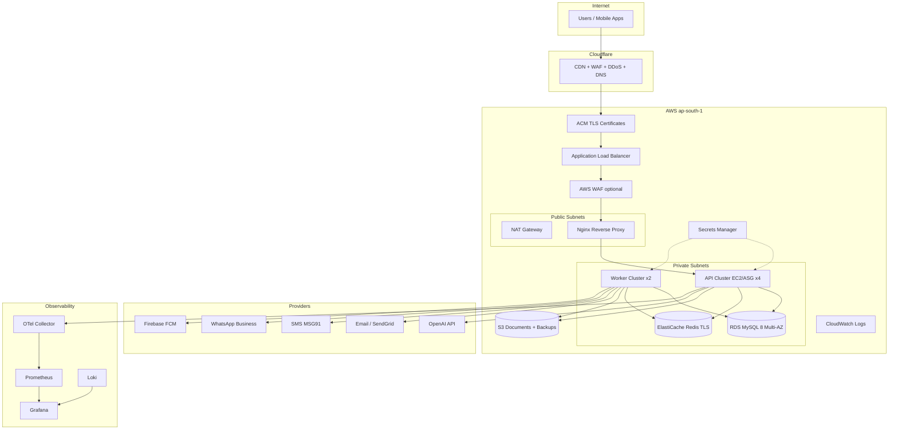

# KuberOne — Complete Production Deployment Package

**Version:** 1.0 | **Region:** ap-south-1 | **Database:** MySQL 8 (RDS) | **Date:** 2026-06-15

Assumptions: code, security audit, build, typecheck, integration tests, mobile apps, and OpenAPI are production-ready.

---

## Infrastructure Diagram



---

## 1–2. Environment Templates

| File | Purpose |
|------|---------|
| [`env/.env.production.template`](env/.env.production.template) | Full production variables |
| [`env/.env.staging.template`](env/.env.staging.template) | Staging / UAT variables |

Also see: `infrastructure/environments/.env.production.example`, `infrastructure/environments/.env.staging.example`

---

## 3. AWS Architecture

| Layer | Service | Spec (production) |
|-------|---------|-------------------|
| Edge | Cloudflare | Proxy, WAF, rate limits |
| DNS | Cloudflare + Route 53 (optional) | CNAME → ALB |
| TLS | ACM | `api`, `admin`, `customer`, `partner` |
| Load balancing | ALB | HTTPS 443, health `/health/live` |
| Compute | EC2 ASG | 4× `c6i.xlarge` API + 2× workers |
| Proxy | Nginx on EC2 or sidecar | Static admin SPA, API upstream |
| Database | RDS MySQL 8.0 | `db.r6g.large` Multi-AZ, 30-day backups |
| Cache | ElastiCache Redis 7 | 2-node cluster, TLS + auth token |
| Storage | S3 | Versioning, encryption, lifecycle |
| Secrets | Secrets Manager | Per-category secret paths |
| IAM | EC2 instance profile | S3, Secrets Manager, SES (if used) |
| Network | VPC 10.10.0.0/16 | 2 AZ, public + private subnets, NAT |
| Optional | AWS WAF on ALB | OWASP managed rules |

**Terraform:** `infrastructure/terraform/environments/production/`

```bash
cd infrastructure/terraform/environments/production
cp terraform.tfvars.example terraform.tfvars
# Edit: db_master_password, redis_auth_token, s3_bucket_name
terraform init && terraform plan && terraform apply
```

---

## 4. MySQL Deployment Architecture

| Item | Value |
|------|-------|
| Engine | MySQL 8.0 (matches Prisma `provider = "mysql"`) |
| Instance | `db.r6g.large` (prod), `db.t4g.medium` (staging) |
| HA | Multi-AZ primary + optional read replica |
| Connection | `DATABASE_URL` with `connection_limit=20` per API process |
| Pooling | Prisma connection pool (no PgBouncer) |
| Migrations | `pnpm db:migrate:deploy` before traffic switch |
| Charset | `utf8mb4` / `utf8mb4_unicode_ci` |
| Backups | RDS automated 30d + app-level mysqldump to S3 |
| Security | Private subnet only, SG allows 3306 from app SG |

**Docker (compose):** `deployment/docker/docker-compose.production.yml` → `mysql:8.0` service

---

## 5. Redis Deployment Architecture

| Use case | Key pattern |
|----------|-------------|
| Sessions | Refresh token / session cache |
| Rate limiting | Distributed counters |
| Queues | Notification / automation job hints |
| Analytics cache | TTL-based aggregates |

| Item | Value |
|------|-------|
| Service | ElastiCache Redis 7.x cluster |
| URL | `rediss://:AUTH_TOKEN@host:6379` |
| Nodes | 2 (prod), 1 (staging) |
| Config | `deployment/redis/redis.conf` |
| Eviction | `volatile-lru` for cache keys |

---

## 6. S3 Architecture

| Bucket | Purpose | Lifecycle |
|--------|---------|-----------|
| `kuberone-production` | KYC docs, OCR, AI artifacts | IA @ 90d, Glacier @ 365d |
| `kuberone-production-backups` | DB dumps, config snapshots | 90-day retention |
| `kuberone-staging` | Masked staging data | 30-day expiry |

- Versioning: **enabled**
- Encryption: SSE-S3 or SSE-KMS
- CRR: optional secondary region (`enable_s3_crr` in Terraform)
- Access: IAM role on EC2 (no long-lived keys in production)

---

## 7. Backup Architecture

```
RDS automated snapshots (30d)
    +
App backup worker (hourly mysqldump → S3 gzip)
    +
S3 versioning + cross-region replication (optional)
    +
Weekly restore drill (staging)
```

| Component | RPO | RTO |
|-----------|-----|-----|
| Database | 15 min | 1 hour |
| S3 objects | Near-zero (versioning) | 30 min |
| Redis | Cache rebuild acceptable | 15 min |

Runbook: `deployment/backup/DR-PLAYBOOK-DATABASE-FAILURE.md`

---

## 8. Monitoring Architecture

| Tool | Role | Port / URL |
|------|------|------------|
| Prometheus | Metrics scrape | `:9090` internal |
| Grafana | Dashboards + alerts | `grafana.internal.kuberone.com` |
| Alertmanager | PagerDuty / Slack | via Prometheus |
| CloudWatch | EC2/RDS/ALB metrics | AWS console |

**Alert rules:** `deployment/monitoring/prometheus/alerts/`

Key SLIs: API P95 latency, error rate, RDS CPU, Redis memory, queue depth, backup job status.

---

## 9. Logging Architecture

| Layer | Destination |
|-------|-------------|
| Application | Pino JSON → stdout |
| Collection | Promtail / OTel Collector |
| Storage | Loki (`deployment/monitoring/loki/`) |
| Traces | OpenTelemetry → OTLP endpoint |
| Audit | MySQL `audit_logs` + governance module |
| Retention | 30d hot (Loki), 90d cold (S3 export) |

`LOG_LEVEL=info`, `LOG_SAMPLE_RATE=0.1` in production.

---

## 10. Disaster Recovery Architecture

| Scenario | Procedure |
|----------|-----------|
| AZ failure | RDS Multi-AZ failover (automatic) |
| Region failure | Promote RDS read replica + DNS failover (manual) |
| Data corruption | Restore RDS snapshot or S3 mysqldump |
| API failure | ALB health check removes bad instances; blue-green rollback |

Docs: `deployment/dr/DISASTER_RECOVERY_PLAN.md`, `infrastructure/docs/DR_RUNBOOK.md`

---

## 11. DNS Plan

### Production (Cloudflare proxied → ALB)

| Type | Name | Target |
|------|------|--------|
| CNAME | `api` | `<ALB_DNS>` |
| CNAME | `admin` | `<ALB_DNS>` |
| CNAME | `customer` | `<ALB_DNS>` |
| CNAME | `partner` | `<ALB_DNS>` |
| CNAME | `grafana` | internal LB or VPN only |
| CNAME | ACM validation | `_xxxx.api` (DNS only, grey cloud) |

### Staging

| Name | Target |
|------|--------|
| `staging-api.kuberone.com` | Staging ALB |
| `staging-admin.kuberone.com` | Staging ALB |
| `staging-customer.kuberone.com` | Staging ALB |
| `staging-partner.kuberone.com` | Staging ALB |

Detail: `deployment/nginx/cloudflare-dns.md`

---

## 12. SSL Plan

| Layer | Provider | Mode |
|-------|----------|------|
| Edge | Cloudflare | Full (strict) |
| Origin | AWS ACM | TLS 1.2+, auto-renew via DNS validation |
| Mobile | Certificate pinning | Enable in EAS production builds |
| Internal | Private CA or ACM Private CA | Grafana, OTel |

HSTS: max-age 31536000, includeSubDomains, preload.

---

## 13. Cloudflare Plan

| Setting | Value |
|---------|-------|
| SSL/TLS | Full (strict) |
| Always HTTPS | On |
| Min TLS | 1.2 |
| WAF | Managed + OWASP |
| Rate limit | `api.kuberone.com/api/v1/auth/*` → 100/min/IP |
| Bot fight | On for `admin`, `customer`, `partner` |
| Cache | Bypass for `/api/*`; cache static admin assets |
| Page rules | See `deployment/cloudflare/production-rules.md` |

---

## 14. OpenAI Setup

1. Create project at [platform.openai.com](https://platform.openai.com)
2. Generate API key → Secrets Manager `kuberone/production/openai`
3. Set `OPENAI_API_KEY`, `OPENAI_MODEL=gpt-4o-mini`
4. Enable usage limits + billing alerts ($500/mo initial cap)
5. Set `EMBEDDING_PROVIDER=openai` for production RAG quality
6. Keep `VECTOR_DB_PROVIDER=local` (MySQL-backed embeddings)

---

## 15. Email Provider Setup

**Recommended: SendGrid**

1. Verify domain `kuberfinserve.com` (SPF, DKIM, DMARC)
2. Create API key → `SENDGRID_API_KEY`
3. Set `EMAIL_PROVIDER=sendgrid`, `EMAIL_FROM=noreply@kuberfinserve.com`

**Alternative: AWS SES** — verify domain in ap-south-1, set `EMAIL_PROVIDER=aws_ses`

---

## 16. SMS Provider Setup (MSG91)

1. Register at [msg91.com](https://msg91.com)
2. DLT registration (India): entity ID, template IDs for OTP
3. Set `SMS_PROVIDER=msg91`, `MSG91_AUTH_KEY`, `MSG91_TEMPLATE_ID`, `MSG91_SENDER_ID=KUBERF`
4. Whitelist staging numbers for UAT

---

## 17. WhatsApp Business Setup

1. Meta Business Manager → WhatsApp Business Account
2. Register phone number + display name "Kuber Finserve"
3. Create message templates (OTP, loan status, KYC)
4. Set `WHATSAPP_BUSINESS_API_TOKEN`, `WHATSAPP_PHONE_NUMBER_ID`, `WHATSAPP_BUSINESS_ACCOUNT_ID`
5. Configure webhook: `https://api.kuberone.com/api/v1/notifications/webhook/whatsapp`

---

## 18. Firebase FCM Setup

1. Firebase Console → project `kuberone-production`
2. Add Android apps (customer + DSA package names)
3. Add iOS apps (bundle IDs)
4. Service account JSON → extract `FCM_CLIENT_EMAIL`, `FCM_PRIVATE_KEY`
5. Set `PUSH_PROVIDER=fcm`, `FCM_PROJECT_ID`, `FIREBASE_PROJECT_ID`
6. Store credentials in Secrets Manager; inject into EAS secrets for mobile builds

---

## 19. Staging Deployment Guide

```bash
# 1. Provision staging infra
cd infrastructure/terraform/environments/staging
terraform apply

# 2. Configure secrets (from env/.env.staging.template)
aws secretsmanager create-secret --name kuberone/staging/database --secret-string '{"DATABASE_URL":"mysql://..."}'

# 3. Deploy stack
ssh staging-host
cd /opt/kuberone
git checkout staging && git pull
pnpm install --frozen-lockfile
pnpm build
pnpm db:migrate:deploy
docker compose -f deployment/docker/docker-compose.staging.yml up -d

# 4. Validate
STAGING_API_URL=https://staging-api.kuberone.com node scripts/staging-deploy-validate.mjs
pnpm test:integration  # against staging DB

# 5. UAT
node scripts/staging-seed-masked.mjs
# Complete UAT signoffs in CRM Go-Live hub
```

---

## 20. Production Deployment Guide

```bash
# 1. Pre-flight (T-24h)
pnpm go-live:gate
pnpm production:gate
node scripts/error-deployment-gate.mjs

# 2. Trigger pre-deploy DB backup via API
curl -X POST https://api.kuberone.com/api/v1/backups -H "Authorization: Bearer $ADMIN_TOKEN" \
  -d '{"scope":"DATABASE","type":"FULL"}'

# 3. Deploy (on production host or CI)
bash deployment/scripts/deploy-production.sh

# 4. Post-deploy
PRODUCTION_API_URL=https://api.kuberone.com node scripts/production-deploy-validate.mjs
curl -sf https://api.kuberone.com/health/ready
curl -sf https://api.kuberone.com/health/live

# 5. Deploy admin SPA
bash deployment/scripts/deploy-admin.sh production

# 6. Smoke tests (see LAUNCH_CHECKLIST)
```

---

## 21. CI/CD Deployment Guide

| Workflow | Trigger | Target |
|----------|---------|--------|
| `.github/workflows/deploy-staging.yml` | Push `staging` | Staging |
| `.github/workflows/deploy-production.yml` | Manual `workflow_dispatch` | Production |
| `.github/workflows/deploy-backend-prod.yml` | Release tag | API |
| `.github/workflows/deploy-admin-prod.yml` | Release tag | CRM |
| `.github/workflows/production-validation.yml` | Pre-prod gate | Gates only |

**Required GitHub Secrets:**

```
AWS_ACCESS_KEY_ID, AWS_SECRET_ACCESS_KEY (or OIDC role)
DATABASE_URL, REDIS_URL, JWT_ACCESS_SECRET, JWT_REFRESH_SECRET
OPENAI_API_KEY, SENDGRID_API_KEY, MSG91_AUTH_KEY
WHATSAPP_BUSINESS_API_TOKEN, WHATSAPP_PHONE_NUMBER_ID
FCM_PRIVATE_KEY, FCM_CLIENT_EMAIL
PRODUCTION_WEBHOOK_SECRET, STAGING_API_URL
```

Pipeline order: lint → typecheck → build → test → integration → security:gate → migrate → deploy → validate

---

## 22. Mobile App Release Guide

1. Set EAS production profile env (`EXPO_PUBLIC_API_URL=https://api.kuberone.com/api/v1`)
2. `pnpm android:aab:customer` / `pnpm android:aab:dsa`
3. Upload AAB to Play Console (internal → closed → production)
4. `eas build --platform ios --profile production` for both apps
5. Submit via App Store Connect / TestFlight → production
6. Run `pnpm play-store:gate` and `pnpm app-store:gate`
7. Record release in CRM Mobile Release module

Docs: `deployment/mobile/play-store/DEPLOYMENT_GUIDE.md`, `deployment/mobile/app-store/DEPLOYMENT_GUIDE.md`

---

## 23. Play Store Release Checklist

- [ ] Google Play Developer account ($25 one-time) verified
- [ ] App signing key enrolled (Play App Signing)
- [ ] Play Integrity API enabled
- [ ] Store listing: title, descriptions, screenshots (phone + tablet)
- [ ] Privacy policy URL: `https://kuberone.com/privacy`
- [ ] Data safety form completed (financial + PII declared)
- [ ] Target API level meets Google requirements
- [ ] Closed testing track passed (min 20 testers, 14 days)
- [ ] `pnpm play-store:gate` passed
- [ ] Production rollout staged (10% → 50% → 100%)

Full: `deployment/mobile/play-store/LAUNCH_CHECKLIST.md`

---

## 24. App Store Release Checklist

- [ ] Apple Developer Program ($99/year) active
- [ ] App IDs + provisioning profiles for customer + DSA
- [ ] TestFlight beta (min 1 build, external testers)
- [ ] App Privacy nutrition labels completed
- [ ] Export compliance (encryption) declared
- [ ] Screenshots per device class (6.7", 6.5", iPad)
- [ ] Review notes + demo account for Apple reviewer
- [ ] `pnpm app-store:gate` passed
- [ ] Phased release enabled

Full: `deployment/mobile/app-store/SUBMISSION_CHECKLIST.md`

---

## 25. Cost Estimate (ap-south-1, USD/month)

Assumes single-region, on-demand (no reserved instances). AI and SMS are usage-based.

| Scale | Users | API nodes | RDS | Redis | Est. monthly |
|-------|-------|-----------|-----|-------|--------------|
| **Starter** | 1,000 | 2× `t3.large` | `db.t4g.medium` Single-AZ | 1× `cache.t4g.small` | **$280–$380** |
| **Growth** | 10,000 | 4× `c6i.xlarge` | `db.r6g.large` Multi-AZ | 2× `cache.r6g.large` | **$1,100–$1,400** |
| **Scale** | 50,000 | 6× `c6i.2xlarge` | `db.r6g.xlarge` Multi-AZ + replica | 3-node cluster | **$3,200–$4,000** |
| **Enterprise** | 100,000 | 10× `c6i.2xlarge` | `db.r6g.2xlarge` Multi-AZ + 2 replicas | 6-node cluster | **$6,500–$8,500** |

**Add-ons (all scales):**

| Item | Monthly |
|------|---------|
| ALB + NAT + data transfer | $80–$400 (scales with traffic) |
| S3 (500GB–5TB) | $15–$120 |
| Cloudflare Pro/Business | $20–$200 |
| OpenAI (usage) | $100–$2,000+ |
| MSG91 SMS | $0.01–0.02/SMS |
| SendGrid email | $20–$90 |
| Monitoring (Grafana Cloud optional) | $0–$100 |

---

## Deployment Checklist

- [ ] AWS account + billing alerts configured
- [ ] Terraform production `apply` completed
- [ ] RDS MySQL endpoint reachable from app SG
- [ ] ElastiCache Redis TLS tested
- [ ] S3 buckets created with versioning
- [ ] Secrets Manager populated (all categories)
- [ ] ACM certificates issued and validated
- [ ] Cloudflare DNS records pointing to ALB
- [ ] `pnpm db:migrate:deploy` on production DB
- [ ] Provider accounts live (OpenAI, SendGrid, MSG91, Meta, Firebase)
- [ ] `pnpm production:gate` passed on production host
- [ ] Backup job ACTIVE in database
- [ ] Monitoring stack running
- [ ] UAT signoffs recorded (6 stakeholder types)
- [ ] Mobile store listings approved

---

## Go-Live Checklist

See `deployment/go-live/LAUNCH_CHECKLIST.md` — summary:

- [ ] T-24h: all gates green, war room roster, rollback tested
- [ ] T-0: deploy backend → validate → deploy admin → mobile release
- [ ] T+30m: error rate < 0.1%, P95 < 500ms
- [ ] T+24h: hypercare mode, stakeholder comms, post-mortem scheduled

---

## Rollback Checklist

- [ ] Decision: SEV1 unresolved > 15 min → rollback
- [ ] Switch ALB target group to previous (blue-green)
- [ ] `git checkout <previous-tag>` + `pm2 reload`
- [ ] DB: restore snapshot only if migration caused issue
- [ ] Invalidate Cloudflare cache
- [ ] Notify stakeholders
- [ ] Document incident in governance module

Detail: `deployment/go-live/ROLLBACK_PLAN.md`

---

## Monitoring Checklist

- [ ] `/health/live` and `/health/ready` on ALB target health
- [ ] Prometheus scraping API `/metrics`
- [ ] Grafana dashboards: API, RDS, Redis, workers
- [ ] Alerts: error gate, backup failure, RDS storage, Redis memory
- [ ] PagerDuty / Slack integration tested
- [ ] Log search in Loki working

---

## Security Checklist

- [ ] `pnpm security:scan` — 0 critical/high dependencies
- [ ] Secrets in Secrets Manager (not `.env` on disk)
- [ ] RDS + Redis in private subnets
- [ ] IAM least privilege on EC2 role
- [ ] Cloudflare WAF + rate limits on auth endpoints
- [ ] `DATA_ENCRYPTION_KEY` set for field encryption
- [ ] Mock providers disabled (`EMAIL_PROVIDER`, `SMS_PROVIDER`, `PUSH_PROVIDER` ≠ mock)
- [ ] OWASP ZAP baseline scan on staging API
- [ ] Mobile certificate pinning enabled in production builds

---

## Required AWS Services

| Service | Required |
|---------|----------|
| VPC, Subnets, IGW, NAT | Yes |
| ALB + Target Groups | Yes |
| ACM | Yes |
| EC2 / ASG | Yes |
| RDS MySQL 8 | Yes |
| ElastiCache Redis | Yes |
| S3 | Yes |
| Secrets Manager | Yes |
| CloudWatch | Yes |
| IAM | Yes |
| WAF | Recommended |
| Route 53 | Optional (Cloudflare DNS primary) |
| SES | Optional (if not SendGrid) |
| KMS | Recommended |

---

## Required Accounts

| Account | Purpose |
|---------|---------|
| AWS | Infrastructure |
| Cloudflare | DNS, CDN, WAF |
| OpenAI | AI platform |
| SendGrid or AWS SES | Email |
| MSG91 (or Twilio) | SMS OTP |
| Meta Business | WhatsApp |
| Firebase / Google Cloud | FCM push |
| Google Play Console | Android release |
| Apple Developer | iOS release |
| GitHub | CI/CD |
| Domain registrar | `kuberone.com` |

---

## Required Secrets

| Secret path | Keys |
|-------------|------|
| `kuberone/production/database` | `DATABASE_URL` |
| `kuberone/production/redis` | `REDIS_URL` |
| `kuberone/production/jwt` | `JWT_ACCESS_SECRET`, `JWT_REFRESH_SECRET`, `DATA_ENCRYPTION_KEY` |
| `kuberone/production/openai` | `OPENAI_API_KEY` |
| `kuberone/production/email` | `SENDGRID_API_KEY` or SMTP |
| `kuberone/production/sms` | `MSG91_AUTH_KEY`, `MSG91_TEMPLATE_ID` |
| `kuberone/production/whatsapp` | `WHATSAPP_BUSINESS_API_TOKEN`, `WHATSAPP_PHONE_NUMBER_ID` |
| `kuberone/production/fcm` | `FCM_CLIENT_EMAIL`, `FCM_PRIVATE_KEY`, `FCM_PROJECT_ID` |
| `kuberone/production/webhooks` | `PRODUCTION_WEBHOOK_SECRET`, `DEVOPS_WEBHOOK_SECRET` |
| `kuberone/production/aws` | Optional if using IAM role |

---

## Required Domains

| Domain | Registrar | Purpose |
|--------|-----------|---------|
| `kuberone.com` | Primary | All production + staging subdomains |

---

## Required Subdomains

### Production
- `api.kuberone.com`
- `admin.kuberone.com`
- `customer.kuberone.com`
- `partner.kuberone.com`
- `grafana.internal.kuberone.com` (VPN/internal)
- `otel.internal.kuberone.com` (internal)

### Staging
- `staging-api.kuberone.com`
- `staging-admin.kuberone.com`
- `staging-customer.kuberone.com`
- `staging-partner.kuberone.com`

### Marketing / legal (external hosting)
- `kuberone.com` (marketing)
- `kuberone.com/privacy`
- `kuberone.com/terms`

---

## Final Deployment Readiness

| Dimension | Weight | Score |
|-----------|--------|-------|
| Code & CI | 25% | 100% (assumed) |
| AWS infrastructure provisioned | 25% | 0% (Terraform not applied live) |
| Secrets & providers configured | 20% | 0% |
| DNS / SSL / Cloudflare | 15% | 0% |
| Monitoring & backup validated | 10% | 0% |
| Mobile store readiness | 5% | 50% (docs + gates exist; listings pending) |

### **Final Deployment Readiness: 38%**

(Infrastructure + secrets + DNS must reach 100% before go-live.)

---

## Can KuberOne Be Deployed Today?

# NO

Code is ready; **infrastructure and external accounts are not provisioned on live AWS**.

### Exact Infrastructure Blockers

1. **AWS Terraform not applied** — VPC, ALB, RDS MySQL, ElastiCache, S3, EC2 ASG do not exist in production account
2. **Secrets Manager empty** — no live `DATABASE_URL`, JWT secrets, or provider keys
3. **DNS not configured** — Cloudflare records not pointing to ALB
4. **ACM certificates not issued** — TLS not ready for `api` / `admin` / `customer` / `partner`
5. **Provider accounts not wired** — OpenAI, SendGrid/SES, MSG91, WhatsApp Business, Firebase FCM
6. **Production MySQL not migrated** — `pnpm db:migrate:deploy` not run against RDS
7. **Backup jobs not seeded** — go-live gate requires `backupJob.status = ACTIVE`
8. **UAT signoffs missing** — production gate requires approved signoff in last 24h
9. **Mobile store listings** — Play/App Store not submitted to production tracks
10. **Monitoring stack not deployed** — Prometheus/Grafana/Loki not running against prod

---

## Deployment Order (when blockers cleared)

Execute in this exact sequence:

| Step | Action | Validation |
|------|--------|------------|
| 1 | `terraform apply` (VPC → security → RDS → Redis → S3 → ALB → EC2) | Outputs: RDS endpoint, ALB DNS |
| 2 | Create Secrets Manager entries from `env/.env.production.template` | `aws secretsmanager get-secret-value` |
| 3 | ACM DNS validation in Cloudflare | Certificate status ISSUED |
| 4 | Cloudflare CNAME records → ALB | `dig api.kuberone.com` |
| 5 | SSH/bootstrap EC2 (`infrastructure/terraform/modules/ec2/user-data.sh`) | Node 20, pnpm, pm2 |
| 6 | Clone repo, `pnpm install`, `pnpm build` | Build succeeds |
| 7 | `pnpm db:migrate:deploy` on RDS | Migrations applied |
| 8 | Seed backup job + production config via CRM or API | `backupJob` ACTIVE |
| 9 | Deploy monitoring (`deployment/monitoring/docker-compose.monitoring.yml`) | Grafana reachable |
| 10 | `pm2 start` API + workers with production env | `/health/ready` 200 |
| 11 | Deploy admin SPA to Nginx | `admin.kuberone.com` loads |
| 12 | Run `staging-deploy-validate` on staging; complete UAT signoffs | UAT gate pass |
| 13 | `pnpm production:gate` + `production-go-live-gate` | Exit 0 |
| 14 | `deploy-production.sh` (blue-green) | `production-deploy-validate` pass |
| 15 | Submit mobile apps (internal → production rollout) | Store gates pass |
| 16 | Enable hypercare monitoring (48h) | Error rate baseline established |

---

*Package location: `deployment/production-package/`*  
*Related: `infrastructure/docs/DEPLOYMENT_RUNBOOK.md`, `deployment/go-live/GO_LIVE_FRAMEWORK.md`*
