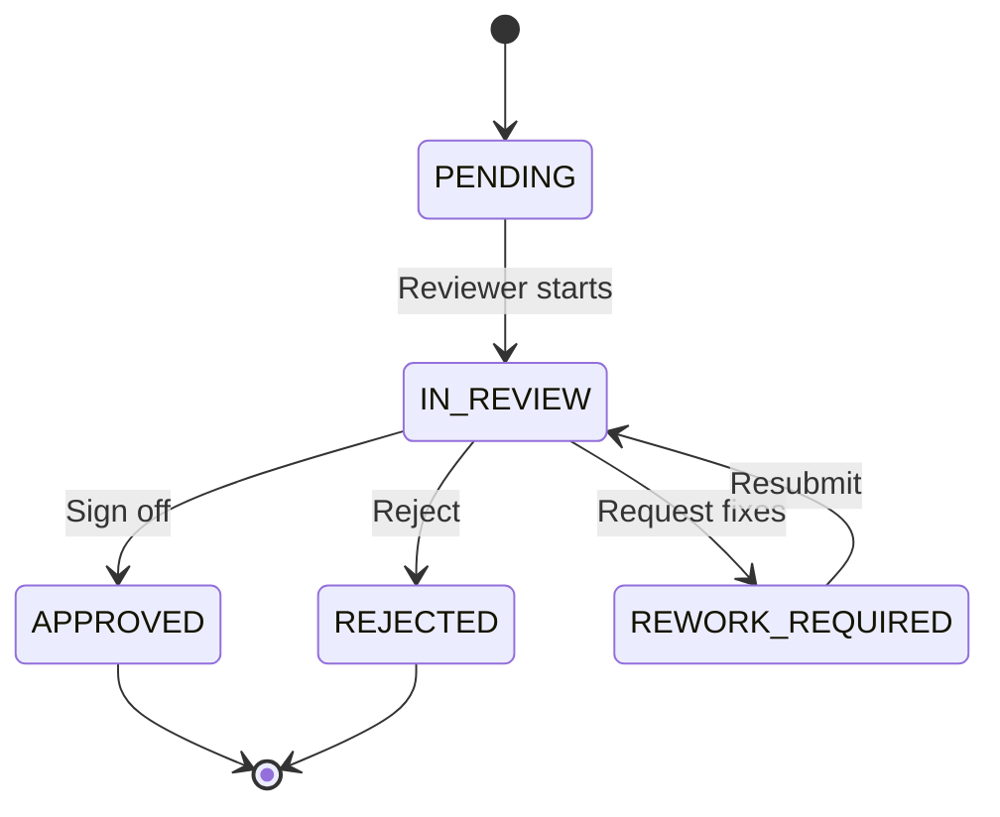

# UAT Approval Workflow

## Digital Signoff Fields

Each stakeholder approval records:

- Approver Name
- Role
- Department
- Date (approvedAt)
- Comments
- Approval Status (stage)

## Workflow

## Certification Domains

| Domain | Stakeholder Groups |
|--------|-------------------|
| Business | Sales, RM, Customer Journey, DSA, Credit, Compliance, Support |
| Technology | Technology Team |
| Operations | Operations Team |
| Security | SECURITY review area approval |
| Management | Management |

## Management Signoff Gate

Management approval (`MANAGEMENT` stakeholder group) is blocked until:

1. All quality gates pass
2. No open critical UAT risks
3. Security and production audit artifacts present

## Launch Authorization

Launch is **AUTHORIZED** only when:

- Final UAT Status = `APPROVED FOR GO-LIVE`
- Go-Live Approval ≥ 85%
- All required digital signoffs = `APPROVED`
