# KuberOne
## ER Diagram & Enterprise Data Model Document

**Company:** Kuber Finserve  
**Website:** [https://kuberfinserve.com](https://kuberfinserve.com)  
**Document Type:** Enterprise Data Architecture — ER Diagram & Data Model  
**Classification:** Database Team Ready | Prisma Ready | Backend Ready | CTO Ready | Future Scale Ready  
**Version:** 1.0  
**Date:** June 2026  
**Tech Stack:** MySQL 8 · Prisma ORM · Node.js · Express.js · TypeScript  
**Related Documents:**
- [KUBERONE_VISION_AND_OBJECTIVES.md](./KUBERONE_VISION_AND_OBJECTIVES.md)
- [KUBERONE_USER_TYPES_AND_ROLES.md](./KUBERONE_USER_TYPES_AND_ROLES.md)
- [KUBERONE_LOAN_PRODUCTS_AND_SERVICES.md](./KUBERONE_LOAN_PRODUCTS_AND_SERVICES.md)
- [KUBERONE_RBAC_AND_PERMISSIONS.md](./KUBERONE_RBAC_AND_PERMISSIONS.md)
- [KUBERONE_SYSTEM_ARCHITECTURE.md](./KUBERONE_SYSTEM_ARCHITECTURE.md)
- [KUBERONE_SCREEN_PLANNING_AND_IA.md](./KUBERONE_SCREEN_PLANNING_AND_IA.md)
- [KUBERONE_DATABASE_SCHEMA_SPECIFICATION.md](./KUBERONE_DATABASE_SCHEMA_SPECIFICATION.md)

---

## Document Control

| Field | Value |
|-------|-------|
| **Product** | KuberOne — AI-Powered Financial Services Ecosystem |
| **Scope** | Logical enterprise data model, entity definitions, relationships, ER diagrams, governance |
| **Audience** | Data Architects, Backend Engineers, DBA, Security, Compliance, CTO |
| **Purpose** | Master foundation for MySQL schema, Prisma models, API contracts, LOS/LMS, analytics |
| **Status** | Authoritative Enterprise Data Model |
| **Out of Scope** | SQL DDL, Prisma schema code, API implementation |

---

## Entity Naming Conventions

| Convention | Rule | Example |
|------------|------|---------|
| **Entity name** | PascalCase singular | `Application`, `LeadScore` |
| **Logical table name** | snake_case plural | `applications`, `lead_scores` |
| **Primary key** | `id` — UUID v4 (external-facing entities) | `550e8400-e29b-41d4-a716-446655440000` |
| **Foreign key** | `{entity}Id` | `customerId`, `applicationId` |
| **Status fields** | Enum type — Prisma enum | `ApplicationStatus`, `LeadStatus` |
| **Timestamps** | `createdAt`, `updatedAt` on all entities | ISO 8601 UTC |
| **Audit columns** | `createdBy`, `updatedBy` on mutable entities | User UUID |
| **Soft delete** | `deletedAt` nullable timestamp | Critical business entities |
| **Tenant scope** | `branchId`, `regionId` where applicable | Operational records |
| **Metadata** | `metadata` JSON — non-queryable extensions only | Workflow context |
| **Money** | `amount` DECIMAL(15,2) + `currency` CHAR(3) default INR | Financial fields |
| **PII fields** | Encrypted at application layer; masked in API | PAN, Aadhaar, account numbers |

---

## Master Entity Registry (Quick Reference)

| Domain | Entity Count | Primary Entities |
|--------|-------------|------------------|
| Identity & Access | 10 | User, Role, Permission, Session |
| Customer | 8 | Customer, CustomerProfile, KycProfile |
| Partner | 7 | DsaPartner, ReferralPartner, PartnerAgreement |
| Organization | 5 | Employee, Branch, Region |
| Product | 7 | ProductFamily, Product, ProductVariant, Lender |
| LMS (Lead) | 8 | Lead, LeadScore, LeadAssignment |
| LOS (Application) | 9 | Application, Sanction, Disbursement |
| Product Extensions | 4 | HomeLoanDetail, LapDetail, BusinessLoanDetail, AutoLoanDetail |
| Document | 7 | Document, DocumentType, OcrResult |
| KYC | 4 | PanVerification, AadhaarVerification |
| Referral | 4 | Referral, ReferralReward |
| Commission | 6 | CommissionRule, CommissionLedger |
| Support | 5 | Ticket, TicketMessage |
| Communication | 6 | Notification, CommunicationLog |
| Campaign | 4 | Campaign, CampaignAudience |
| AI | 7 | ChatSession, VoiceSession, KnowledgeSource |
| Knowledge Base | 6 | KnowledgeArticle, Faq, SalesScript |
| Analytics | 5 | KpiDefinition, MetricSnapshot |
| Audit | 5 | AuditLog, AccessLog |
| Settings | 5 | SystemSetting, ProductSetting |
| **Total Logical Entities** | **131** | 112 core + 19 product extensions/junctions |

---

# 30. EXECUTIVE SUMMARY

*Board-level data architecture summary — presented first.*

## Strategic Data Position

KuberOne's enterprise data model is a **unified, domain-driven logical schema** spanning **131 logical entities** (112 core + 19 product extensions) across **20 bounded domains**, designed to power Customer App, DSA App, CRM, LOS, LMS, AI modules, and analytics from a **single MySQL 8 database** accessed via **Prisma ORM**.

| Dimension | Design Decision |
|-----------|----------------|
| **Architecture pattern** | Modular monolith — logical domain separation; single database Phase 1–2 |
| **Normalization** | 3NF default; controlled denormalization for analytics snapshots |
| **Identity model** | Unified `User` entity with role-based profiles (Customer, Partner, Employee) |
| **Product model** | Polymorphic application with product-family extension tables |
| **LOS/LMS integration** | Lead converts to Application; shared customer, document, commission threads |
| **Multi-tenancy** | Branch/region scoping — not separate databases |
| **Auditability** | Immutable audit logs; soft deletes; full change history on critical entities |
| **Future products** | Extension pattern — new product families plug into core LOS without redesign |

## Entity Landscape

```
KUBERONE DATA MODEL (20 Domains)
├── Identity & Access (10 entities)
├── Customer (8)
├── Partner (7)
├── Organization (5)
├── Product (7)
├── LMS — Lead Management (8)
├── LOS — Loan Origination (9)
├── Product Extensions — HL/LAP/BL/AL (4)
├── Document Management (7)
├── KYC (4)
├── Referral (4)
├── Commission (6)
├── Support (5)
├── Communication (6)
├── Campaign (4)
├── AI (7)
├── Knowledge Base (6)
├── Analytics (5)
├── Audit (5)
└── Settings (5)
```

## Business Impact

| Outcome | Data Model Enabler |
|---------|-------------------|
| Single customer view | Customer 360 via `Customer` + profiles + applications + interactions |
| Partner network scale | Isolated partner scope with performance and commission linkage |
| Regulatory compliance | KYC audit trail, document versioning, immutable audit logs |
| AI differentiation | Conversation, recommendation, and RAG source entities linked to customer context |
| Revenue accuracy | Commission ledger with rule engine, approval workflow, payout reconciliation |
| Executive reporting | KPI/metric snapshots decoupled from operational writes |

## Scalability Posture

| Phase | Data Volume | Response |
|-------|------------|----------|
| Phase 1 | <10M rows | Single RDS MySQL; indexed operational queries |
| Phase 2 | 10–100M rows | Read replica; analytics snapshot tables; Redis cache |
| Phase 3 | 100M+ rows | Table partitioning (audit, logs); warehouse export |
| Phase 4 | Multi-product national | Optional domain DB split (analytics, AI logs) |

## Security & Compliance

- PII encryption at application layer (PAN, Aadhaar, bank accounts)
- RBAC enforced via Identity domain — 22 roles, 25 resources
- Segregation of Duties reflected in approval entities (commission, credit, disbursement)
- 8-year document retention; 2–10 year audit retention per category
- GDPR-style consent and deletion request tracking via `CustomerConsent`

**Board Recommendation:** Approve this enterprise data model as the authoritative foundation for all KuberOne database, Prisma, and backend development.

---

# 1. DATA ARCHITECTURE OVERVIEW

## 1.1 Data Design Principles

| # | Principle | Description | Implementation |
|---|-----------|-------------|----------------|
| 1 | **Single source of truth** | One canonical record per business entity | UUID-keyed entities; no duplicate customer records without merge workflow |
| 2 | **Domain boundaries** | Clear bounded contexts with explicit relationships | 20 logical domains; cross-domain via foreign keys only |
| 3 | **Audit everything critical** | Financial, PII, and status changes are traceable | `AuditLog`, `ChangeLog`, `createdBy`/`updatedBy` |
| 4 | **Soft delete by default** | Business records retained for compliance | `deletedAt` on Customer, Application, Lead, Partner |
| 5 | **Immutable financial records** | Commission and disbursement records are append-only | Adjustments via `CommissionAdjustment`; no hard delete |
| 6 | **External IDs are opaque** | UUIDs prevent enumeration attacks | All API-facing entity IDs are UUID v4 |
| 7 | **Config as data** | Rules, workflows, commission logic stored as structured config | JSON columns for rule definitions; versioned |
| 8 | **Documents in S3, metadata in DB** | Binary content never in MySQL | `Document` stores S3 key, checksum, metadata |
| 9 | **Status as enums** | Lifecycle states are typed, not free text | Prisma enums: `LeadStatus`, `ApplicationStage`, etc. |
| 10 | **Tenant scoping** | Operational data scoped to branch/region | `branchId` on Lead, Application, Employee assignment |

## 1.2 Normalization Strategy

| Level | Application | Examples |
|-------|-------------|----------|
| **1NF** | Atomic values; no repeating groups | Address as separate entity, not JSON array |
| **2NF** | No partial dependencies | Product variant attributes in `ProductVariant`, not duplicated in Application |
| **3NF (default)** | No transitive dependencies | Customer income in `IncomeDetail`, not embedded in Application |
| **Controlled denormalization** | Read-optimized aggregates | `MetricSnapshot`, `PartnerPerformance` summary fields |
| **JSON columns (limited)** | Non-queryable metadata | Workflow context, OCR raw payload, AI prompt variables |
| **Avoid** | Storing computed values that drift | Eligibility results stored as snapshot at check time; recalculated on demand |

## 1.3 Scalability Strategy

| Layer | Strategy | Phase |
|-------|----------|-------|
| **Write path** | Single primary MySQL; connection pooling via Prisma | Phase 1 |
| **Read path** | Indexed queries; selective `include`; pagination | Phase 1 |
| **Read replica** | Analytics dashboards, report generation | Phase 2 |
| **Caching** | Redis for session, product catalog, eligibility rules | Phase 2 |
| **Partitioning** | RANGE partition on `audit_logs`, `communication_logs`, `ai_query_logs` by month | Phase 3 |
| **Archival** | Closed applications → summary record + S3 archive | Phase 2 |
| **Warehouse export** | Nightly ETL to analytics warehouse | Phase 3 |
| **Horizontal API scale** | Stateless API; DB remains central bottleneck managed via replica + cache | Phase 2–3 |

## 1.4 Multi-Product Design

```
                    ┌─────────────────┐
                    │  ProductFamily  │
                    │  (HL, LAP, BL,  │
                    │   AL, PL*, INS*)│
                    └────────┬────────┘
                             │ 1:N
                    ┌────────▼────────┐
                    │     Product     │
                    │  (HL-01, LAP-02)│
                    └────────┬────────┘
                             │ 1:N
                    ┌────────▼────────┐
                    │ ProductVariant  │
                    │ (Fresh, BT, etc)│
                    └────────┬────────┘
                             │
              ┌──────────────┼──────────────┐
              │              │              │
     ┌────────▼────┐ ┌───────▼──────┐ ┌────▼─────────┐
     │ Eligibility │ │ DocumentRule │ │ LenderPolicy │
     │    Rule     │ │              │ │              │
     └─────────────┘ └──────────────┘ └──────────────┘
                             │
                    ┌────────▼────────┐
                    │   Application   │  ← Core LOS entity
                    └────────┬────────┘
                             │ 1:1 (polymorphic)
              ┌──────────────┼──────────────┬──────────────┐
              │              │              │              │
     ┌────────▼────┐ ┌───────▼──────┐ ┌────▼────────┐ ┌───▼──────────┐
     │HomeLoanDetail│ │  LapDetail   │ │BusinessLoan │ │ AutoLoanDetail│
     │              │ │              │ │   Detail    │ │              │
     └─────────────┘ └──────────────┘ └─────────────┘ └──────────────┘
```

**Extension pattern:** New products (Personal Loan, Insurance) add a `ProductFamily` row + extension table — core `Application` entity unchanged.

## 1.5 Multi-Role Design

```
┌──────────────────────────────────────────────────────────────┐
│                         User (Identity)                       │
│  id, phone, email, passwordHash, userType, status            │
└───────────┬──────────────────┬──────────────────┬────────────┘
            │ 1:1              │ 1:1              │ 1:1
   ┌────────▼────────┐ ┌───────▼────────┐ ┌──────▼───────────┐
   │    Customer     │ │   DsaPartner   │ │     Employee     │
   │  (borrower)     │ │  (partner)     │ │  (internal)      │
   └─────────────────┘ └────────────────┘ └──────────────────┘
            │                                    │
            │ N:M via UserRole                   │ N:M via UserRole
            └────────────────┬───────────────────┘
                    ┌──────────▼──────────┐
                    │   Role + Permission  │
                    │  (22 roles, RBAC)    │
                    └─────────────────────┘
```

- One `User` may have one primary profile type (`userType`: CUSTOMER | DSA | REFERRAL | EMPLOYEE)
- Employees hold multiple roles via `UserRole` junction
- API authorization resolves: User → Roles → Permissions → Resource scope

## 1.6 Auditability

| Audit Type | Entity | Retention | Immutable |
|------------|--------|-----------|-----------|
| Business audit | `AuditLog` | 7 years | Yes |
| Data access | `AccessLog` | 3 years | Yes |
| Field changes | `ChangeLog` | 7 years | Yes |
| Approvals | `ApprovalLog` | 7 years | Yes |
| Security events | `SecurityEvent` | 3 years | Yes |
| Entity-level | `createdBy`, `updatedBy` | Life of record | — |
| Status history | `LeadStatusHistory`, `ApplicationTimeline` | Life of record | Append-only |

## 1.7 Security

| Control | Data Model Support |
|---------|-------------------|
| Encryption at rest | MySQL TDE; S3 SSE for documents |
| PII field encryption | Application-layer AES-256 for PAN, Aadhaar, account numbers |
| Masking | Separate `maskedPan`, `maskedAadhaar` display fields |
| RBAC | Permission entities linked to roles; scope columns on operational records |
| SoD | Approval entities require separate approver identity |
| Session management | `Session`, `RefreshToken` with expiry and revocation |
| Device binding | `DeviceRegistration` for mobile push and fraud detection |

## 1.8 Future Expansion

| Future Product | Extension Required | Core Changes |
|----------------|-------------------|--------------|
| Personal Loan | `PersonalLoanDetail` extension | None |
| Insurance | `InsuranceDetail` + policy entities | None |
| Credit Card | `CreditCardApplicationDetail` | None |
| Mutual Fund | `MfHolding`, `SipMandate` | New wealth subdomain |
| Fixed Deposit | `FdBookingDetail` | None |
| Gold Loan | `GoldLoanDetail` + pledge items | None |
| Wealth Management | `WealthPortfolio`, `AdvisorySession` | New subdomain |
| Video KYC | `VideoKycSession` in KYC domain | None |
| eSign | `EsignSession` in Document domain | None |
| Lender Portal | `LenderUser`, `LenderSubmission` enhancement | Partner domain extension |

---

# 2. MASTER ENTITY MAP

## 2.1 Enterprise Entity Relationship Overview

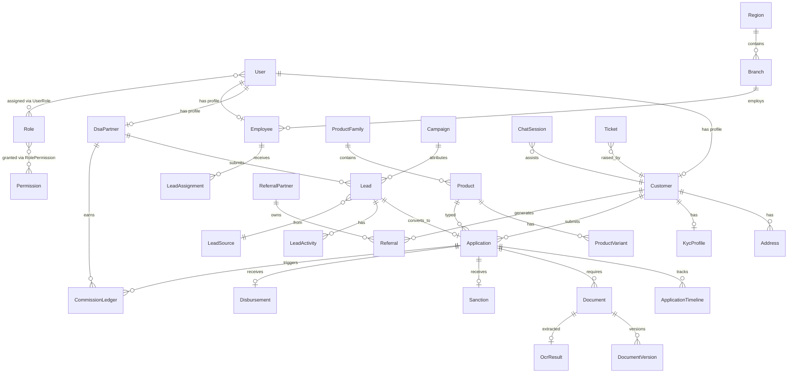

## 2.2 Domain-to-Domain Dependency Matrix

| Domain | Depends On | Depended On By |
|--------|-----------|----------------|
| Identity | — | All domains |
| Organization | Identity | LMS, LOS, Commission, Analytics |
| Customer | Identity | LMS, LOS, KYC, Document, Referral, AI, Support |
| Partner | Identity, Organization | LMS, Commission, Referral |
| Product | — | LMS, LOS, Eligibility, Document, Commission |
| LMS | Customer, Partner, Product, Organization | LOS, Analytics, Campaign |
| LOS | Customer, Product, LMS, Document | Commission, Analytics, KYC |
| Document | Customer, Application | KYC, LOS |
| KYC | Customer, Document | LOS |
| Commission | Partner, Application, Product | Analytics |
| Referral | Customer, Partner | Commission |
| Support | Customer, Identity | Communication |
| Communication | Identity, Customer | Campaign, LMS, LOS |
| Campaign | Customer, Product | LMS |
| AI | Customer, Product, Knowledge | LOS, LMS |
| Knowledge | — | AI, Support |
| Analytics | All operational | Management |
| Audit | All mutable | Compliance |
| Settings | — | All domains |

## 2.3 Cross-Domain Key Relationships

| From Entity | To Entity | Relationship | Business Rule |
|-------------|-----------|--------------|---------------|
| Lead | Application | 1:0..1 | One lead converts to max one application |
| Application | Lead | 0..1:1 | Application may originate from lead or direct |
| Customer | Application | 1:N | Customer may have multiple concurrent applications |
| DsaPartner | Lead | 1:N | Partner submits leads; scoped to partnerId |
| Application | Sanction | 1:0..1 | Sanction exists only after lender approval |
| Application | Disbursement | 1:0..1 | Disbursement triggers commission |
| Application | CommissionLedger | 1:N | Multiple commission lines per application (DSA, referral, override) |
| Customer | Referral | 1:N | Customer generates referral codes |
| Employee | LeadAssignment | 1:N | Sales executive assignment history |
| Product | EligibilityRule | 1:N | Rules per product variant |
| Document | Application | N:1 | Documents linked to application checklist |

---

# 3. IDENTITY & ACCESS DOMAIN

## 3.1 Domain Purpose

Manages authentication, authorization, session lifecycle, and device trust for all KuberOne users — customers, DSA partners, referral partners, and internal employees.

## 3.2 Entity Definitions

### 3.2.1 User

| Attribute | Type | Required | Description |
|-----------|------|----------|-------------|
| id | UUID | Yes | Primary key |
| userType | Enum | Yes | CUSTOMER, DSA, REFERRAL, EMPLOYEE |
| phone | String(15) | Yes | Primary identifier; E.164 format |
| phoneVerified | Boolean | Yes | OTP verified flag |
| email | String(255) | No | Secondary identifier |
| emailVerified | Boolean | Yes | Default false |
| passwordHash | String | No | Required for CRM employees; null for OTP-only users |
| status | Enum | Yes | ACTIVE, INACTIVE, SUSPENDED, PENDING_VERIFICATION |
| lastLoginAt | DateTime | No | Last successful login |
| mfaEnabled | Boolean | Yes | MFA for employees |
| createdAt | DateTime | Yes | — |
| updatedAt | DateTime | Yes | — |
| deletedAt | DateTime | No | Soft delete |

### 3.2.2 Role

| Attribute | Type | Required | Description |
|-----------|------|----------|-------------|
| id | UUID | Yes | Primary key |
| code | String(50) | Yes | Unique: SALES_EXECUTIVE, CREDIT_EXECUTIVE, etc. |
| name | String(100) | Yes | Display name |
| description | Text | No | Role purpose |
| roleType | Enum | Yes | INTERNAL, PARTNER, CUSTOMER, SYSTEM |
| isSystem | Boolean | Yes | System roles cannot be deleted |
| hierarchyLevel | Integer | No | For permission inheritance |
| createdAt | DateTime | Yes | — |
| updatedAt | DateTime | Yes | — |

**Seed roles (22):** Customer, Referral Partner, DSA Partner, Sales Executive, RM, Credit Executive, Ops Executive, Branch Manager, Regional Manager, Support Executive, Support Manager, Compliance Executive, Compliance Manager, Admin, Super Admin, CEO, Director, Business Head, Sales Head, Ops Head, Finance Head, System.

### 3.2.3 Permission

| Attribute | Type | Required | Description |
|-----------|------|----------|-------------|
| id | UUID | Yes | Primary key |
| code | String(100) | Yes | e.g., `leads:read:branch` |
| resource | String(50) | Yes | RES-01 through RES-25 |
| action | Enum | Yes | CREATE, READ, UPDATE, DELETE, APPROVE, EXPORT, EXECUTE |
| scope | Enum | Yes | OWN, ASSIGNED, BRANCH, REGION, ALL |
| description | Text | No | Human-readable |
| createdAt | DateTime | Yes | — |

### 3.2.4 RolePermission (Junction)

| Attribute | Type | Required | Description |
|-----------|------|----------|-------------|
| id | UUID | Yes | Primary key |
| roleId | UUID | Yes | FK → Role |
| permissionId | UUID | Yes | FK → Permission |
| granted | Boolean | Yes | true = grant; false = explicit deny |
| conditions | JSON | No | Field-level modifiers |
| createdAt | DateTime | Yes | — |

**Cardinality:** Role N:M Permission

### 3.2.5 UserRole (Junction)

| Attribute | Type | Required | Description |
|-----------|------|----------|-------------|
| id | UUID | Yes | Primary key |
| userId | UUID | Yes | FK → User |
| roleId | UUID | Yes | FK → Role |
| scopeBranchId | UUID | No | Branch scope override |
| scopeRegionId | UUID | No | Region scope override |
| assignedBy | UUID | No | FK → User (admin) |
| validFrom | DateTime | Yes | — |
| validTo | DateTime | No | Expiry for temporary roles |
| createdAt | DateTime | Yes | — |

**Cardinality:** User N:M Role

### 3.2.6 Session

| Attribute | Type | Required | Description |
|-----------|------|----------|-------------|
| id | UUID | Yes | Primary key |
| userId | UUID | Yes | FK → User |
| tokenHash | String | Yes | Hashed session token |
| clientType | Enum | Yes | CUSTOMER_APP, DSA_APP, CRM_WEB |
| ipAddress | String(45) | No | Client IP |
| userAgent | String(500) | No | Device/browser info |
| expiresAt | DateTime | Yes | Session expiry |
| revokedAt | DateTime | No | Manual revocation |
| createdAt | DateTime | Yes | — |

### 3.2.7 OtpVerification

| Attribute | Type | Required | Description |
|-----------|------|----------|-------------|
| id | UUID | Yes | Primary key |
| userId | UUID | No | FK → User (null for pre-registration) |
| phone | String(15) | Yes | Target phone |
| otpHash | String | Yes | Hashed OTP |
| purpose | Enum | Yes | LOGIN, REGISTRATION, KYC, TRANSACTION |
| attempts | Integer | Yes | Failed attempt count |
| maxAttempts | Integer | Yes | Default 3 |
| expiresAt | DateTime | Yes | OTP expiry (5 min) |
| verifiedAt | DateTime | No | Successful verification time |
| createdAt | DateTime | Yes | — |

### 3.2.8 DeviceRegistration

| Attribute | Type | Required | Description |
|-----------|------|----------|-------------|
| id | UUID | Yes | Primary key |
| userId | UUID | Yes | FK → User |
| deviceId | String(255) | Yes | Unique device fingerprint |
| platform | Enum | Yes | IOS, ANDROID, WEB |
| fcmToken | String(500) | No | Push notification token |
| appVersion | String(20) | No | Client version |
| isTrusted | Boolean | Yes | Trusted device flag |
| lastActiveAt | DateTime | No | — |
| createdAt | DateTime | Yes | — |
| updatedAt | DateTime | Yes | — |

### 3.2.9 LoginHistory

| Attribute | Type | Required | Description |
|-----------|------|----------|-------------|
| id | UUID | Yes | Primary key |
| userId | UUID | Yes | FK → User |
| sessionId | UUID | No | FK → Session |
| loginMethod | Enum | Yes | OTP, PASSWORD, MFA |
| ipAddress | String(45) | No | — |
| userAgent | String(500) | No | — |
| location | String(100) | No | Geo-derived |
| success | Boolean | Yes | Login outcome |
| failureReason | String(100) | No | If failed |
| createdAt | DateTime | Yes | — |

### 3.2.10 RefreshToken

| Attribute | Type | Required | Description |
|-----------|------|----------|-------------|
| id | UUID | Yes | Primary key |
| userId | UUID | Yes | FK → User |
| sessionId | UUID | Yes | FK → Session |
| tokenHash | String | Yes | Hashed refresh token |
| expiresAt | DateTime | Yes | Typically 30 days |
| revokedAt | DateTime | No | — |
| replacedById | UUID | No | Token rotation chain |
| createdAt | DateTime | Yes | — |

## 3.3 Relationships & Cardinality

| Relationship | Cardinality | FK Location | Notes |
|--------------|-------------|-------------|-------|
| User → Customer | 1:0..1 | Customer.userId | Borrower profile |
| User → DsaPartner | 1:0..1 | DsaPartner.userId | Partner profile |
| User → Employee | 1:0..1 | Employee.userId | Internal staff |
| User ↔ Role | N:M | UserRole | Employees may have multiple roles |
| Role ↔ Permission | N:M | RolePermission | RBAC matrix |
| User → Session | 1:N | Session.userId | Multiple active sessions allowed |
| User → OtpVerification | 1:N | OtpVerification.userId | Historical OTP records |
| User → DeviceRegistration | 1:N | DeviceRegistration.userId | Per device |
| User → LoginHistory | 1:N | LoginHistory.userId | Append-only |
| Session → RefreshToken | 1:N | RefreshToken.sessionId | Token rotation |

## 3.4 Lifecycle — User Status

```
PENDING_VERIFICATION → ACTIVE → INACTIVE
                          ↓
                      SUSPENDED → ACTIVE (on reinstate)
                          ↓
                      (soft delete via deletedAt)
```

## 3.5 Lifecycle — Session

```
CREATED → ACTIVE → EXPIRED (auto)
              ↓
          REVOKED (manual/logout)
```

---

# 4. CUSTOMER DOMAIN

## 4.1 Domain Purpose

Stores borrower identity, profile, financial profile, KYC state, preferences, and regulatory consents. Foundation for Customer 360 in CRM and self-service in Customer App.

## 4.2 Entity Definitions

### 4.2.1 Customer

| Attribute | Type | Required | Description |
|-----------|------|----------|-------------|
| id | UUID | Yes | Primary key |
| userId | UUID | Yes | FK → User (1:1) |
| customerCode | String(20) | Yes | Human-readable: KFC-000001 |
| firstName | String(100) | Yes | — |
| lastName | String(100) | No | — |
| fullName | String(200) | Yes | Computed/display |
| dateOfBirth | Date | No | — |
| gender | Enum | No | MALE, FEMALE, OTHER, PREFER_NOT_TO_SAY |
| maritalStatus | Enum | No | SINGLE, MARRIED, DIVORCED, WIDOWED |
| profileCompletionPct | Integer | Yes | 0–100 |
| kycStatus | Enum | Yes | NOT_STARTED, IN_PROGRESS, VERIFIED, REJECTED, EXPIRED |
| rmEmployeeId | UUID | No | FK → Employee (post-disbursement) |
| branchId | UUID | No | FK → Branch (servicing branch) |
| source | Enum | Yes | DIRECT, DSA, REFERRAL, CAMPAIGN, WALK_IN |
| metadata | JSON | No | Extended attributes |
| createdAt | DateTime | Yes | — |
| updatedAt | DateTime | Yes | — |
| deletedAt | DateTime | No | Soft delete |

### 4.2.2 CustomerProfile

| Attribute | Type | Required | Description |
|-----------|------|----------|-------------|
| id | UUID | Yes | Primary key |
| customerId | UUID | Yes | FK → Customer (1:1) |
| photoUrl | String(500) | No | S3 key for profile photo |
| alternatePhone | String(15) | No | — |
| alternateEmail | String(255) | No | — |
| preferredLanguage | Enum | Yes | EN, HI, TA, TE, MR, BN, GU, KN, ML |
| preferredContactChannel | Enum | Yes | SMS, WHATSAPP, EMAIL, PUSH, CALL |
| nationality | String(50) | Yes | Default INDIA |
| residentialStatus | Enum | No | RESIDENT, NRI, PIO |
| createdAt | DateTime | Yes | — |
| updatedAt | DateTime | Yes | — |

### 4.2.3 Address

| Attribute | Type | Required | Description |
|-----------|------|----------|-------------|
| id | UUID | Yes | Primary key |
| customerId | UUID | Yes | FK → Customer |
| addressType | Enum | Yes | CURRENT, PERMANENT, OFFICE, PROPERTY |
| line1 | String(255) | Yes | — |
| line2 | String(255) | No | — |
| landmark | String(100) | No | — |
| city | String(100) | Yes | — |
| state | String(100) | Yes | — |
| pincode | String(10) | Yes | — |
| country | String(50) | Yes | Default INDIA |
| isPrimary | Boolean | Yes | Primary address flag |
| verifiedAt | DateTime | No | Address verification timestamp |
| createdAt | DateTime | Yes | — |
| updatedAt | DateTime | Yes | — |

### 4.2.4 Employment

| Attribute | Type | Required | Description |
|-----------|------|----------|-------------|
| id | UUID | Yes | Primary key |
| customerId | UUID | Yes | FK → Customer |
| employmentType | Enum | Yes | SALARIED, SELF_EMPLOYED, BUSINESS_OWNER, PROFESSIONAL, RETIRED, OTHER |
| employerName | String(200) | No | Company/business name |
| designation | String(100) | No | Job title |
| industry | String(100) | No | Industry sector |
| yearsInCurrentJob | Decimal(4,1) | No | — |
| totalExperienceYears | Decimal(4,1) | No | — |
| officeAddressId | UUID | No | FK → Address |
| isCurrent | Boolean | Yes | Current employment flag |
| startDate | Date | No | — |
| endDate | Date | No | — |
| createdAt | DateTime | Yes | — |
| updatedAt | DateTime | Yes | — |

### 4.2.5 IncomeDetail

| Attribute | Type | Required | Description |
|-----------|------|----------|-------------|
| id | UUID | Yes | Primary key |
| customerId | UUID | Yes | FK → Customer |
| employmentId | UUID | No | FK → Employment |
| incomeType | Enum | Yes | MONTHLY_SALARY, ANNUAL_INCOME, BUSINESS_INCOME, RENTAL, OTHER |
| grossAmount | Decimal(15,2) | Yes | Gross income |
| netAmount | Decimal(15,2) | No | Net/take-home |
| frequency | Enum | Yes | MONTHLY, ANNUAL |
| currency | String(3) | Yes | INR |
| declaredAt | DateTime | Yes | Customer declaration time |
| verifiedAt | DateTime | No | Verified by credit team |
| createdAt | DateTime | Yes | — |
| updatedAt | DateTime | Yes | — |

### 4.2.6 KycProfile

| Attribute | Type | Required | Description |
|-----------|------|----------|-------------|
| id | UUID | Yes | Primary key |
| customerId | UUID | Yes | FK → Customer (1:1) |
| panNumberEncrypted | String | No | AES encrypted |
| panMasked | String(10) | No | XXXXX1234X |
| panVerified | Boolean | Yes | — |
| panVerifiedAt | DateTime | No | — |
| aadhaarNumberEncrypted | String | No | AES encrypted |
| aadhaarMasked | String(12) | No | XXXX-XXXX-1234 |
| aadhaarVerified | Boolean | Yes | — |
| aadhaarVerifiedAt | DateTime | No | — |
| ckycNumber | String(20) | No | CKYC registry ID |
| overallStatus | Enum | Yes | NOT_STARTED, PARTIAL, COMPLETE, REJECTED, EXPIRED |
| lastReviewedAt | DateTime | No | — |
| expiresAt | DateTime | No | KYC re-verification due |
| createdAt | DateTime | Yes | — |
| updatedAt | DateTime | Yes | — |

### 4.2.7 CustomerPreference

| Attribute | Type | Required | Description |
|-----------|------|----------|-------------|
| id | UUID | Yes | Primary key |
| customerId | UUID | Yes | FK → Customer (1:1) |
| pushEnabled | Boolean | Yes | Push notifications |
| smsEnabled | Boolean | Yes | SMS |
| emailEnabled | Boolean | Yes | Email |
| whatsappEnabled | Boolean | Yes | WhatsApp |
| marketingOptIn | Boolean | Yes | Marketing communications |
| aiAdvisorEnabled | Boolean | Yes | AI features |
| voiceAiEnabled | Boolean | Yes | Voice AI |
| createdAt | DateTime | Yes | — |
| updatedAt | DateTime | Yes | — |

### 4.2.8 CustomerConsent

| Attribute | Type | Required | Description |
|-----------|------|----------|-------------|
| id | UUID | Yes | Primary key |
| customerId | UUID | Yes | FK → Customer |
| consentType | Enum | Yes | TERMS, PRIVACY, KYC, CREDIT_CHECK, MARKETING, DATA_SHARING |
| consentVersion | String(20) | Yes | Policy version accepted |
| granted | Boolean | Yes | true = accepted |
| grantedAt | DateTime | No | Timestamp of consent |
| revokedAt | DateTime | No | Withdrawal timestamp |
| ipAddress | String(45) | No | Capture IP |
| userAgent | String(500) | No | — |
| createdAt | DateTime | Yes | — |

## 4.3 Relationships & Cardinality

| Relationship | Cardinality | Notes |
|--------------|-------------|-------|
| User → Customer | 1:1 | One login per customer |
| Customer → CustomerProfile | 1:1 | Extended profile |
| Customer → Address | 1:N | Multiple address types |
| Customer → Employment | 1:N | History supported; one current |
| Customer → IncomeDetail | 1:N | Linked to employment |
| Customer → KycProfile | 1:1 | Central KYC state |
| Customer → CustomerPreference | 1:1 | Notification prefs |
| Customer → CustomerConsent | 1:N | Versioned consents |
| Customer → Application | 1:N | Multiple loans |
| Employee → Customer (RM) | 1:N | RM assignment post-disbursement |

## 4.4 Lifecycle — Customer KYC Status

```
NOT_STARTED → IN_PROGRESS → VERIFIED
                ↓              ↓
            REJECTED       EXPIRED → IN_PROGRESS (re-KYC)
```

---

# 5. PARTNER DOMAIN

## 5.1 Domain Purpose

Manages DSA (Direct Selling Agent) partners, referral partners, their KYC, banking, performance metrics, and contractual agreements.

## 5.2 Entity Definitions

### 5.2.1 DsaPartner

| Attribute | Type | Required | Description |
|-----------|------|----------|-------------|
| id | UUID | Yes | Primary key |
| userId | UUID | Yes | FK → User (1:1) |
| partnerCode | String(20) | Yes | KFP-DSA-00001 |
| businessName | String(200) | No | Registered business name |
| partnerType | Enum | Yes | INDIVIDUAL, PROPRIETORSHIP, PVT_LTD, LLP |
| tier | Enum | Yes | BRONZE, SILVER, GOLD, PLATINUM |
| status | Enum | Yes | PENDING, ACTIVE, SUSPENDED, TERMINATED |
| branchId | UUID | Yes | FK → Branch (primary branch) |
| regionId | UUID | Yes | FK → Region |
| onboardingCompletedAt | DateTime | No | — |
| agreementSignedAt | DateTime | No | — |
| certifiedProducts | JSON | No | Array of product family codes |
| performanceScore | Decimal(5,2) | No | 0–100 composite score |
| createdAt | DateTime | Yes | — |
| updatedAt | DateTime | Yes | — |
| deletedAt | DateTime | No | — |

### 5.2.2 ReferralPartner

| Attribute | Type | Required | Description |
|-----------|------|----------|-------------|
| id | UUID | Yes | Primary key |
| userId | UUID | Yes | FK → User (1:1) |
| partnerCode | String(20) | Yes | KFP-REF-00001 |
| referralCode | String(20) | Yes | Unique shareable code |
| displayName | String(100) | Yes | — |
| partnerCategory | Enum | Yes | INDIVIDUAL, CA, BUILDER, DEALER, OTHER |
| status | Enum | Yes | PENDING, ACTIVE, SUSPENDED |
| totalReferrals | Integer | Yes | Counter |
| totalConversions | Integer | Yes | Counter |
| createdAt | DateTime | Yes | — |
| updatedAt | DateTime | Yes | — |

### 5.2.3 PartnerKyc

| Attribute | Type | Required | Description |
|-----------|------|----------|-------------|
| id | UUID | Yes | Primary key |
| partnerId | UUID | Yes | FK → DsaPartner or ReferralPartner |
| partnerType | Enum | Yes | DSA, REFERRAL |
| panNumberEncrypted | String | No | — |
| panMasked | String(10) | No | — |
| panVerified | Boolean | Yes | — |
| aadhaarNumberEncrypted | String | No | — |
| aadhaarMasked | String(12) | No | — |
| gstNumber | String(15) | No | GSTIN for business |
| kycStatus | Enum | Yes | PENDING, VERIFIED, REJECTED |
| verifiedBy | UUID | No | FK → Employee |
| verifiedAt | DateTime | No | — |
| createdAt | DateTime | Yes | — |
| updatedAt | DateTime | Yes | — |

### 5.2.4 PartnerBankDetail

| Attribute | Type | Required | Description |
|-----------|------|----------|-------------|
| id | UUID | Yes | Primary key |
| partnerId | UUID | Yes | FK → DsaPartner |
| accountHolderName | String(200) | Yes | — |
| accountNumberEncrypted | String | Yes | AES encrypted |
| accountNumberMasked | String(20) | Yes | XXXXXX1234 |
| ifscCode | String(11) | Yes | — |
| bankName | String(100) | Yes | — |
| accountType | Enum | Yes | SAVINGS, CURRENT |
| isPrimary | Boolean | Yes | Payout account |
| verifiedAt | DateTime | No | Penny drop verification |
| createdAt | DateTime | Yes | — |
| updatedAt | DateTime | Yes | — |

### 5.2.5 PartnerDocument

| Attribute | Type | Required | Description |
|-----------|------|----------|-------------|
| id | UUID | Yes | Primary key |
| partnerId | UUID | Yes | FK → DsaPartner |
| documentType | Enum | Yes | PAN, AADHAAR, AGREEMENT, GST, CANCELLED_CHEQUE, PHOTO |
| s3Key | String(500) | Yes | S3 object key |
| fileName | String(255) | Yes | Original filename |
| mimeType | String(100) | Yes | — |
| fileSizeBytes | Integer | Yes | — |
| checksum | String(64) | Yes | SHA-256 |
| status | Enum | Yes | UPLOADED, VERIFIED, REJECTED |
| verifiedBy | UUID | No | FK → Employee |
| createdAt | DateTime | Yes | — |

### 5.2.6 PartnerPerformance

| Attribute | Type | Required | Description |
|-----------|------|----------|-------------|
| id | UUID | Yes | Primary key |
| partnerId | UUID | Yes | FK → DsaPartner |
| periodType | Enum | Yes | DAILY, WEEKLY, MONTHLY, QUARTERLY |
| periodStart | Date | Yes | — |
| periodEnd | Date | Yes | — |
| leadsSubmitted | Integer | Yes | — |
| leadsConverted | Integer | Yes | — |
| applicationsSubmitted | Integer | Yes | — |
| disbursements | Integer | Yes | — |
| disbursementAmount | Decimal(15,2) | Yes | Total disbursed |
| commissionEarned | Decimal(15,2) | Yes | — |
| conversionRate | Decimal(5,2) | No | Computed |
| rank | Integer | No | Leaderboard position |
| createdAt | DateTime | Yes | Snapshot timestamp |

### 5.2.7 PartnerAgreement

| Attribute | Type | Required | Description |
|-----------|------|----------|-------------|
| id | UUID | Yes | Primary key |
| partnerId | UUID | Yes | FK → DsaPartner |
| agreementType | Enum | Yes | DSA_AGREEMENT, NDA, PRODUCT_CERTIFICATION |
| agreementVersion | String(20) | Yes | — |
| documentId | UUID | No | FK → PartnerDocument |
| signedAt | DateTime | No | eSign timestamp |
| validFrom | Date | Yes | — |
| validTo | Date | No | Expiry |
| status | Enum | Yes | DRAFT, PENDING_SIGNATURE, ACTIVE, EXPIRED, TERMINATED |
| createdAt | DateTime | Yes | — |

## 5.3 Relationships & Cardinality

| Relationship | Cardinality | Notes |
|--------------|-------------|-------|
| User → DsaPartner | 1:1 | Partner login |
| User → ReferralPartner | 1:1 | Referral login |
| DsaPartner → Lead | 1:N | Partner-submitted leads |
| DsaPartner → PartnerKyc | 1:1 | — |
| DsaPartner → PartnerBankDetail | 1:N | Multiple accounts; one primary |
| DsaPartner → PartnerDocument | 1:N | — |
| DsaPartner → PartnerPerformance | 1:N | Periodic snapshots |
| DsaPartner → PartnerAgreement | 1:N | Versioned agreements |
| DsaPartner → CommissionLedger | 1:N | Earnings |
| Branch → DsaPartner | 1:N | Branch assignment |

## 5.4 Lifecycle — DSA Partner Status

```
PENDING → ACTIVE → SUSPENDED → ACTIVE (reinstate)
              ↓
          TERMINATED (soft delete)
```

---

# 6. ORGANIZATION DOMAIN

## 6.1 Domain Purpose

Defines internal organizational structure — employees, branches, regions, departments, and reporting hierarchy. Enables branch/region-scoped data access per RBAC.

## 6.2 Entity Definitions

### 6.2.1 Employee

| Attribute | Type | Required | Description |
|-----------|------|----------|-------------|
| id | UUID | Yes | Primary key |
| userId | UUID | Yes | FK → User (1:1) |
| employeeCode | String(20) | Yes | KFE-00001 |
| firstName | String(100) | Yes | — |
| lastName | String(100) | No | — |
| designation | String(100) | Yes | — |
| departmentId | UUID | Yes | FK → Department |
| branchId | UUID | Yes | FK → Branch |
| regionId | UUID | Yes | FK → Region |
| reportsToId | UUID | No | FK → Employee (self-ref) |
| joiningDate | Date | Yes | — |
| status | Enum | Yes | ACTIVE, ON_LEAVE, RESIGNED, TERMINATED |
| createdAt | DateTime | Yes | — |
| updatedAt | DateTime | Yes | — |

### 6.2.2 Branch

| Attribute | Type | Required | Description |
|-----------|------|----------|-------------|
| id | UUID | Yes | Primary key |
| branchCode | String(20) | Yes | BR-MUM-01 |
| name | String(100) | Yes | — |
| regionId | UUID | Yes | FK → Region |
| address | Text | No | Physical address |
| city | String(100) | Yes | — |
| state | String(100) | Yes | — |
| pincode | String(10) | No | — |
| managerEmployeeId | UUID | No | FK → Employee |
| isActive | Boolean | Yes | — |
| createdAt | DateTime | Yes | — |
| updatedAt | DateTime | Yes | — |

### 6.2.3 Region

| Attribute | Type | Required | Description |
|-----------|------|----------|-------------|
| id | UUID | Yes | Primary key |
| regionCode | String(20) | Yes | REG-WEST |
| name | String(100) | Yes | — |
| managerEmployeeId | UUID | No | FK → Employee (Regional Manager) |
| isActive | Boolean | Yes | — |
| createdAt | DateTime | Yes | — |
| updatedAt | DateTime | Yes | — |

### 6.2.4 Department

| Attribute | Type | Required | Description |
|-----------|------|----------|-------------|
| id | UUID | Yes | Primary key |
| code | String(20) | Yes | SALES, CREDIT, OPS, FINANCE, SUPPORT, COMPLIANCE, ADMIN |
| name | String(100) | Yes | — |
| headEmployeeId | UUID | No | FK → Employee |
| createdAt | DateTime | Yes | — |

### 6.2.5 ReportingStructure

| Attribute | Type | Required | Description |
|-----------|------|----------|-------------|
| id | UUID | Yes | Primary key |
| employeeId | UUID | Yes | FK → Employee |
| managerId | UUID | Yes | FK → Employee |
| relationshipType | Enum | Yes | DIRECT, DOTTED, FUNCTIONAL |
| effectiveFrom | Date | Yes | — |
| effectiveTo | Date | No | Historical tracking |
| createdAt | DateTime | Yes | — |

## 6.3 Organization Hierarchy

```
Company (Kuber Finserve)
└── Region (e.g., West, North, South, East)
    └── Branch (e.g., Mumbai-01, Delhi-02)
        └── Department (Sales, Credit, Ops, ...)
            └── Employee
                └── ReportingStructure → Manager Employee
```

## 6.4 Relationships & Cardinality

| Relationship | Cardinality | Notes |
|--------------|-------------|-------|
| Region → Branch | 1:N | Geographic hierarchy |
| Branch → Employee | 1:N | Primary branch assignment |
| Department → Employee | 1:N | Functional grouping |
| Employee → Employee (reportsTo) | N:1 | Direct manager |
| Employee → ReportingStructure | 1:N | Historical reporting lines |
| Employee → LeadAssignment | 1:N | Sales assignments |
| Branch → Lead | 1:N | Branch-scoped leads |
| Branch → Application | 1:N | Branch-scoped applications |

---

# 7. PRODUCT DOMAIN

## 7.1 Domain Purpose

Defines loan product catalog, variants, eligibility rules, document requirements, and lender policies. Configurable by Admin without schema changes for new variants within existing families.

## 7.2 Entity Definitions

### 7.2.1 ProductFamily

| Attribute | Type | Required | Description |
|-----------|------|----------|-------------|
| id | UUID | Yes | Primary key |
| code | String(10) | Yes | HL, LAP, BL, AL, PL*, INS* |
| name | String(100) | Yes | Home Loan, LAP, etc. |
| description | Text | No | — |
| isSecured | Boolean | Yes | Collateral required |
| displayOrder | Integer | Yes | Catalog sort |
| isActive | Boolean | Yes | — |
| createdAt | DateTime | Yes | — |

### 7.2.2 Product

| Attribute | Type | Required | Description |
|-----------|------|----------|-------------|
| id | UUID | Yes | Primary key |
| familyId | UUID | Yes | FK → ProductFamily |
| code | String(10) | Yes | HL-01, LAP-02, BL-03, AL-01 |
| name | String(200) | Yes | Fresh Home Loan, etc. |
| description | Text | No | — |
| minAmount | Decimal(15,2) | Yes | Minimum loan amount |
| maxAmount | Decimal(15,2) | Yes | Maximum loan amount |
| minTenureMonths | Integer | Yes | — |
| maxTenureMonths | Integer | Yes | — |
| minInterestRate | Decimal(5,2) | No | Indicative rate |
| maxInterestRate | Decimal(5,2) | No | — |
| priority | Enum | Yes | P0, P1, P2, P3 |
| isActive | Boolean | Yes | — |
| launchDate | Date | No | — |
| createdAt | DateTime | Yes | — |
| updatedAt | DateTime | Yes | — |

### 7.2.3 ProductVariant

| Attribute | Type | Required | Description |
|-----------|------|----------|-------------|
| id | UUID | Yes | Primary key |
| productId | UUID | Yes | FK → Product |
| variantCode | String(20) | Yes | FRESH, BT, TOP_UP, BT_TOP_UP |
| name | String(100) | Yes | Display variant name |
| description | Text | No | — |
| isActive | Boolean | Yes | — |
| config | JSON | No | Variant-specific parameters |
| createdAt | DateTime | Yes | — |

### 7.2.4 EligibilityRule

| Attribute | Type | Required | Description |
|-----------|------|----------|-------------|
| id | UUID | Yes | Primary key |
| productId | UUID | Yes | FK → Product |
| variantId | UUID | No | FK → ProductVariant (optional) |
| ruleName | String(100) | Yes | — |
| ruleType | Enum | Yes | AGE, INCOME, FOIR, LTV, CIBIL, EMPLOYMENT, CUSTOM |
| ruleDefinition | JSON | Yes | Rule logic (min, max, operator, value) |
| priority | Integer | Yes | Evaluation order |
| isActive | Boolean | Yes | — |
| effectiveFrom | Date | Yes | — |
| effectiveTo | Date | No | — |
| createdAt | DateTime | Yes | — |

### 7.2.5 DocumentRule

| Attribute | Type | Required | Description |
|-----------|------|----------|-------------|
| id | UUID | Yes | Primary key |
| productId | UUID | Yes | FK → Product |
| variantId | UUID | No | FK → ProductVariant |
| documentTypeId | UUID | Yes | FK → DocumentType |
| isMandatory | Boolean | Yes | Required for submission |
| stage | Enum | Yes | S03, S04, S05, S07 (when required) |
| employmentType | Enum | No | SALARIED, SELF_EMPLOYED (conditional) |
| description | Text | No | Instructions to customer |
| createdAt | DateTime | Yes | — |

### 7.2.6 Lender

| Attribute | Type | Required | Description |
|-----------|------|----------|-------------|
| id | UUID | Yes | Primary key |
| code | String(20) | Yes | LND-HDFC, LND-ICICI |
| name | String(200) | Yes | — |
| lenderType | Enum | Yes | BANK, NBFC, HFC |
| contactEmail | String(255) | No | — |
| integrationType | Enum | Yes | MANUAL, API, EMAIL |
| isActive | Boolean | Yes | — |
| createdAt | DateTime | Yes | — |

### 7.2.7 LenderPolicy

| Attribute | Type | Required | Description |
|-----------|------|----------|-------------|
| id | UUID | Yes | Primary key |
| lenderId | UUID | Yes | FK → Lender |
| productId | UUID | Yes | FK → Product |
| minAmount | Decimal(15,2) | Yes | Lender-specific min |
| maxAmount | Decimal(15,2) | Yes | — |
| maxLtv | Decimal(5,2) | No | Loan-to-value cap |
| maxFoir | Decimal(5,2) | No | FOIR cap |
| minCibil | Integer | No | Minimum CIBIL score |
| processingFeePct | Decimal(5,2) | No | — |
| commissionRate | Decimal(5,2) | No | Kuber commission % |
| turnaroundDays | Integer | No | Expected TAT |
| policyDocument | String(500) | No | S3 key for policy PDF |
| isActive | Boolean | Yes | — |
| effectiveFrom | Date | Yes | — |
| effectiveTo | Date | No | — |
| createdAt | DateTime | Yes | — |

## 7.3 Relationships & Cardinality

| Relationship | Cardinality | Notes |
|--------------|-------------|-------|
| ProductFamily → Product | 1:N | 4 families, 20 launch products |
| Product → ProductVariant | 1:N | Fresh, BT, Top-Up, etc. |
| Product → EligibilityRule | 1:N | Multiple rules per product |
| Product → DocumentRule | 1:N | Checklist definition |
| Lender → LenderPolicy | 1:N | Per product mapping |
| Product → LenderPolicy | 1:N | Multi-lender routing |
| Product → Application | 1:N | Application typed to product |

---

# 8. LEAD MANAGEMENT DOMAIN (LMS)

## 8.1 Domain Purpose

Captures, scores, assigns, and tracks sales leads from all channels until conversion to loan application. Powers CRM sales queue and DSA lead tracking.

## 8.2 Entity Definitions

### 8.2.1 Lead

| Attribute | Type | Required | Description |
|-----------|------|----------|-------------|
| id | UUID | Yes | Primary key |
| leadCode | String(20) | Yes | KFL-000001 |
| customerId | UUID | No | FK → Customer (if known) |
| prospectName | String(200) | Yes | — |
| prospectPhone | String(15) | Yes | — |
| prospectEmail | String(255) | No | — |
| productId | UUID | Yes | FK → Product |
| variantId | UUID | No | FK → ProductVariant |
| sourceId | UUID | Yes | FK → LeadSource |
| dsaPartnerId | UUID | No | FK → DsaPartner |
| referralPartnerId | UUID | No | FK → ReferralPartner |
| campaignId | UUID | No | FK → Campaign |
| branchId | UUID | Yes | FK → Branch |
| regionId | UUID | Yes | FK → Region |
| requestedAmount | Decimal(15,2) | No | Estimated loan amount |
| status | Enum | Yes | NEW, CONTACTED, QUALIFIED, UNQUALIFIED, CONVERTED, LOST, EXPIRED |
| priority | Enum | Yes | LOW, MEDIUM, HIGH, URGENT |
| slaDeadline | DateTime | No | SLA breach time |
| convertedApplicationId | UUID | No | FK → Application |
| convertedAt | DateTime | No | Conversion timestamp |
| lostReason | String(200) | No | If status = LOST |
| metadata | JSON | No | UTM, device, location |
| createdAt | DateTime | Yes | — |
| updatedAt | DateTime | Yes | — |
| deletedAt | DateTime | No | — |
| createdBy | UUID | No | FK → User |

### 8.2.2 LeadSource

| Attribute | Type | Required | Description |
|-----------|------|----------|-------------|
| id | UUID | Yes | Primary key |
| code | String(20) | Yes | DSA, CUSTOMER_APP, REFERRAL, CAMPAIGN, WALK_IN, AI_ADVISOR, VOICE_AI |
| name | String(100) | Yes | — |
| channel | Enum | Yes | DIGITAL, PARTNER, DIRECT, INBOUND |
| isActive | Boolean | Yes | — |
| createdAt | DateTime | Yes | — |

### 8.2.3 LeadScore

| Attribute | Type | Required | Description |
|-----------|------|----------|-------------|
| id | UUID | Yes | Primary key |
| leadId | UUID | Yes | FK → Lead |
| score | Integer | Yes | 0–100 |
| scoreBand | Enum | Yes | COLD, WARM, HOT |
| factors | JSON | Yes | Scoring factor breakdown |
| modelVersion | String(20) | Yes | AI/rules version |
| calculatedAt | DateTime | Yes | — |
| createdAt | DateTime | Yes | — |

### 8.2.4 LeadAssignment

| Attribute | Type | Required | Description |
|-----------|------|----------|-------------|
| id | UUID | Yes | Primary key |
| leadId | UUID | Yes | FK → Lead |
| assignedToId | UUID | Yes | FK → Employee |
| assignedById | UUID | No | FK → Employee (or system) |
| assignmentType | Enum | Yes | AUTO, MANUAL, ROUND_ROBIN, ESCALATION |
| assignedAt | DateTime | Yes | — |
| unassignedAt | DateTime | No | Reassignment end |
| isCurrent | Boolean | Yes | Active assignment flag |
| createdAt | DateTime | Yes | — |

### 8.2.5 LeadActivity

| Attribute | Type | Required | Description |
|-----------|------|----------|-------------|
| id | UUID | Yes | Primary key |
| leadId | UUID | Yes | FK → Lead |
| activityType | Enum | Yes | CALL, SMS, EMAIL, WHATSAPP, MEETING, NOTE, STATUS_CHANGE |
| performedById | UUID | Yes | FK → User |
| description | Text | No | Activity detail |
| disposition | Enum | No | CONNECTED, NO_ANSWER, CALLBACK, NOT_INTERESTED, INTERESTED |
| durationSeconds | Integer | No | Call duration |
| scheduledAt | DateTime | No | For scheduled activities |
| completedAt | DateTime | No | — |
| createdAt | DateTime | Yes | — |

### 8.2.6 LeadStatusHistory

| Attribute | Type | Required | Description |
|-----------|------|----------|-------------|
| id | UUID | Yes | Primary key |
| leadId | UUID | Yes | FK → Lead |
| fromStatus | Enum | No | Previous status |
| toStatus | Enum | Yes | New status |
| changedById | UUID | Yes | FK → User |
| reason | String(200) | No | — |
| createdAt | DateTime | Yes | — |

### 8.2.7 LeadNote

| Attribute | Type | Required | Description |
|-----------|------|----------|-------------|
| id | UUID | Yes | Primary key |
| leadId | UUID | Yes | FK → Lead |
| authorId | UUID | Yes | FK → User |
| content | Text | Yes | Note body |
| isPinned | Boolean | Yes | — |
| createdAt | DateTime | Yes | — |
| updatedAt | DateTime | Yes | — |

### 8.2.8 LeadFollowUp

| Attribute | Type | Required | Description |
|-----------|------|----------|-------------|
| id | UUID | Yes | Primary key |
| leadId | UUID | Yes | FK → Lead |
| assignedToId | UUID | Yes | FK → Employee |
| followUpType | Enum | Yes | CALL, MEETING, DOCUMENT_REQUEST |
| scheduledAt | DateTime | Yes | — |
| completedAt | DateTime | No | — |
| status | Enum | Yes | PENDING, COMPLETED, MISSED, CANCELLED |
| notes | Text | No | — |
| reminderSent | Boolean | Yes | — |
| createdAt | DateTime | Yes | — |

## 8.3 Relationships & Cardinality

| Relationship | Cardinality | Notes |
|--------------|-------------|-------|
| Lead → LeadSource | N:1 | Every lead has one source |
| Lead → Customer | N:0..1 | Linked when customer exists |
| Lead → DsaPartner | N:0..1 | Partner-submitted leads |
| Lead → Application | 1:0..1 | Conversion |
| Lead → LeadScore | 1:N | Re-scored over time |
| Lead → LeadAssignment | 1:N | Assignment history |
| Lead → LeadActivity | 1:N | Activity log |
| Lead → LeadStatusHistory | 1:N | Status audit |
| Lead → LeadNote | 1:N | — |
| Lead → LeadFollowUp | 1:N | Scheduled follow-ups |
| Employee → LeadAssignment | 1:N | Sales executive workload |

## 8.4 Lifecycle — Lead Status

```
NEW → CONTACTED → QUALIFIED → CONVERTED (→ Application)
  ↓       ↓            ↓
LOST   LOST      UNQUALIFIED
  ↓
EXPIRED (auto after SLA)
```

---

# 9. LOAN ORIGINATION DOMAIN (LOS)

## 9.1 Domain Purpose

Manages the complete loan application lifecycle from creation through sanction, disbursement, and closure. Implements the unified 9-stage LOS workflow (S01–S09).

## 9.2 Entity Definitions

### 9.2.1 Application

| Attribute | Type | Required | Description |
|-----------|------|----------|-------------|
| id | UUID | Yes | Primary key |
| applicationCode | String(20) | Yes | KFA-000001 |
| customerId | UUID | Yes | FK → Customer |
| productId | UUID | Yes | FK → Product |
| variantId | UUID | No | FK → ProductVariant |
| leadId | UUID | No | FK → Lead (originating lead) |
| dsaPartnerId | UUID | No | FK → DsaPartner |
| branchId | UUID | Yes | FK → Branch |
| regionId | UUID | Yes | FK → Region |
| currentStage | Enum | Yes | S01–S09 (ApplicationStage) |
| status | Enum | Yes | DRAFT, IN_PROGRESS, ON_HOLD, APPROVED, REJECTED, WITHDRAWN, DISBURSED, CLOSED |
| requestedAmount | Decimal(15,2) | Yes | — |
| requestedTenureMonths | Integer | Yes | — |
| purpose | String(200) | No | Loan purpose description |
| assignedSalesId | UUID | No | FK → Employee |
| assignedCreditId | UUID | No | FK → Employee |
| assignedOpsId | UUID | No | FK → Employee |
| selectedLenderId | UUID | No | FK → Lender |
| submittedAt | DateTime | No | Customer submission time |
| metadata | JSON | No | Wizard state, UI context |
| createdAt | DateTime | Yes | — |
| updatedAt | DateTime | Yes | — |
| deletedAt | DateTime | No | — |
| createdBy | UUID | No | FK → User |

### 9.2.2 ApplicationStatus (Current State Snapshot)

| Attribute | Type | Required | Description |
|-----------|------|----------|-------------|
| id | UUID | Yes | Primary key |
| applicationId | UUID | Yes | FK → Application (1:1) |
| stage | Enum | Yes | S01–S09 |
| subStatus | String(50) | No | Stage-specific sub-status |
| statusReason | String(200) | No | Hold/reject reason |
| slaDeadline | DateTime | No | Current stage SLA |
| isSlaBreached | Boolean | Yes | — |
| updatedAt | DateTime | Yes | — |

### 9.2.3 ApplicationTimeline

| Attribute | Type | Required | Description |
|-----------|------|----------|-------------|
| id | UUID | Yes | Primary key |
| applicationId | UUID | Yes | FK → Application |
| stage | Enum | Yes | S01–S09 |
| eventType | Enum | Yes | STAGE_ENTERED, STAGE_COMPLETED, REWORK, HOLD, ESCALATION |
| fromStage | Enum | No | For transitions |
| toStage | Enum | No | — |
| performedById | UUID | No | FK → User |
| notes | Text | No | — |
| metadata | JSON | No | Stage-specific data |
| createdAt | DateTime | Yes | — |

### 9.2.4 EligibilityResult

| Attribute | Type | Required | Description |
|-----------|------|----------|-------------|
| id | UUID | Yes | Primary key |
| applicationId | UUID | Yes | FK → Application |
| customerId | UUID | Yes | FK → Customer |
| productId | UUID | Yes | FK → Product |
| result | Enum | Yes | ELIGIBLE, CONDITIONAL, INELIGIBLE |
| maxEligibleAmount | Decimal(15,2) | No | — |
| recommendedTenure | Integer | No | Months |
| recommendedEmi | Decimal(15,2) | No | — |
| foir | Decimal(5,2) | No | FOIR at check time |
| ltv | Decimal(5,2) | No | LTV at check time |
| ruleResults | JSON | Yes | Per-rule pass/fail detail |
| engineVersion | String(20) | Yes | Rules version |
| checkedAt | DateTime | Yes | — |
| checkedById | UUID | No | FK → User (if manual override) |
| createdAt | DateTime | Yes | — |

### 9.2.5 BankLogin

| Attribute | Type | Required | Description |
|-----------|------|----------|-------------|
| id | UUID | Yes | Primary key |
| applicationId | UUID | Yes | FK → Application |
| lenderId | UUID | Yes | FK → Lender |
| loginReference | String(100) | No | Lender reference number |
| loginDate | DateTime | Yes | Submission date |
| submittedById | UUID | Yes | FK → Employee (Ops) |
| acknowledgmentReceived | Boolean | Yes | Lender ack flag |
| acknowledgmentAt | DateTime | No | — |
| status | Enum | Yes | SUBMITTED, ACKNOWLEDGED, QUERY_RAISED, REJECTED |
| notes | Text | No | — |
| createdAt | DateTime | Yes | — |

### 9.2.6 CreditReview

| Attribute | Type | Required | Description |
|-----------|------|----------|-------------|
| id | UUID | Yes | Primary key |
| applicationId | UUID | Yes | FK → Application |
| reviewerId | UUID | Yes | FK → Employee (Credit) |
| reviewType | Enum | Yes | INTERNAL, LENDER_QUERY, REWORK |
| decision | Enum | Yes | APPROVED, REJECTED, QUERY, PENDING |
| cibilScore | Integer | No | At review time |
| riskGrade | Enum | No | LOW, MEDIUM, HIGH |
| conditions | Text | No | Approval conditions |
| rejectionReason | String(200) | No | — |
| reviewedAt | DateTime | No | — |
| createdAt | DateTime | Yes | — |

### 9.2.7 Sanction

| Attribute | Type | Required | Description |
|-----------|------|----------|-------------|
| id | UUID | Yes | Primary key |
| applicationId | UUID | Yes | FK → Application (1:1) |
| lenderId | UUID | Yes | FK → Lender |
| sanctionedAmount | Decimal(15,2) | Yes | — |
| sanctionedTenureMonths | Integer | Yes | — |
| interestRate | Decimal(5,2) | Yes | ROI % |
| processingFee | Decimal(15,2) | No | — |
| emiAmount | Decimal(15,2) | No | — |
| sanctionLetterS3Key | String(500) | No | Sanction letter document |
| sanctionDate | Date | Yes | — |
| validityDate | Date | No | Sanction expiry |
| conditions | Text | No | Pre-disbursement conditions |
| status | Enum | Yes | ISSUED, ACCEPTED, EXPIRED, CANCELLED |
| createdAt | DateTime | Yes | — |

### 9.2.8 Disbursement

| Attribute | Type | Required | Description |
|-----------|------|----------|-------------|
| id | UUID | Yes | Primary key |
| applicationId | UUID | Yes | FK → Application (1:1) |
| lenderId | UUID | Yes | FK → Lender |
| disbursedAmount | Decimal(15,2) | Yes | — |
| disbursementDate | Date | Yes | — |
| utrNumber | String(50) | No | Bank UTR reference |
| disbursementMode | Enum | Yes | FULL, PARTIAL, TRANCHE |
| trancheNumber | Integer | No | For partial disbursements |
| commissionTriggered | Boolean | Yes | Commission event fired |
| createdAt | DateTime | Yes | — |

### 9.2.9 Closure

| Attribute | Type | Required | Description |
|-----------|------|----------|-------------|
| id | UUID | Yes | Primary key |
| applicationId | UUID | Yes | FK → Application (1:1) |
| closureType | Enum | Yes | DISBURSED_COMPLETE, REJECTED, WITHDRAWN, CANCELLED |
| closureDate | Date | Yes | — |
| closureReason | String(200) | No | — |
| rmAssignedId | UUID | No | FK → Employee (portfolio handoff) |
| archivedAt | DateTime | No | Archive timestamp |
| createdAt | DateTime | Yes | — |

## 9.3 LOS Stage Model (S01–S09)

| Stage | Code | Entity Trigger | Gate Condition |
|-------|------|----------------|----------------|
| Lead Created | S01 | Lead created / Application draft | Contact info captured |
| Qualified | S02 | Lead → Application | Sales qualification |
| Document Collection | S03 | ApplicationTimeline | Mandatory docs uploaded |
| Eligibility Check | S04 | EligibilityResult | Engine pass |
| Bank Login | S05 | BankLogin | Credit approval for submission |
| Credit Review | S06 | CreditReview | Lender underwriting |
| Sanction | S07 | Sanction | Lender sanction issued |
| Disbursement | S08 | Disbursement | Funds released |
| Closure | S09 | Closure | Application complete |

## 9.4 Relationships & Cardinality

| Relationship | Cardinality | Notes |
|--------------|-------------|-------|
| Customer → Application | 1:N | Multiple concurrent allowed (different products) |
| Lead → Application | 1:0..1 | Conversion link |
| Product → Application | 1:N | — |
| Application → ApplicationStatus | 1:1 | Current state |
| Application → ApplicationTimeline | 1:N | Full history |
| Application → EligibilityResult | 1:N | Re-checks allowed |
| Application → BankLogin | 1:N | Multi-lender attempts |
| Application → CreditReview | 1:N | Review iterations |
| Application → Sanction | 1:0..1 | — |
| Application → Disbursement | 1:0..N | Partial/tranche |
| Application → Closure | 1:1 | Terminal state |
| Application → Document | 1:N | Checklist documents |
| Application → CommissionLedger | 1:N | Commission lines |

## 9.5 Lifecycle — Application Status

```
DRAFT → IN_PROGRESS → ON_HOLD → IN_PROGRESS
              ↓
         APPROVED → DISBURSED → CLOSED
              ↓
         REJECTED → CLOSED
              ↓
         WITHDRAWN → CLOSED
```

---

# 10. HOME LOAN DATA MODEL

## 10.1 Extension Entity: HomeLoanDetail

| Attribute | Type | Required | Description |
|-----------|------|----------|-------------|
| id | UUID | Yes | Primary key |
| applicationId | UUID | Yes | FK → Application (1:1) |
| variantCode | Enum | Yes | FRESH, BT, TOP_UP, BT_TOP_UP |
| propertyType | Enum | Yes | READY, UNDER_CONSTRUCTION, PLOT, RESALE |
| propertyValue | Decimal(15,2) | Yes | Market/agreement value |
| propertyAddressId | UUID | No | FK → Address |
| builderName | String(200) | No | For under-construction |
| projectName | String(200) | No | RERA project name |
| reraNumber | String(50) | No | RERA registration |
| occupancyType | Enum | Yes | SELF_OCCUPIED, RENTED, VACANT |
| loanPurpose | Enum | Yes | PURCHASE, CONSTRUCTION, RENOVATION, PLOT_PURCHASE |
| downPaymentAmount | Decimal(15,2) | No | Customer contribution |
| ltv | Decimal(5,2) | No | Computed LTV |
| createdAt | DateTime | Yes | — |
| updatedAt | DateTime | Yes | — |

## 10.2 Extension Entity: HomeLoanBalanceTransferDetail

| Attribute | Type | Required | Description |
|-----------|------|----------|-------------|
| id | UUID | Yes | Primary key |
| homeLoanDetailId | UUID | Yes | FK → HomeLoanDetail (1:1) |
| existingLenderName | String(200) | Yes | Current lender |
| existingLoanAmount | Decimal(15,2) | Yes | Outstanding principal |
| existingEmi | Decimal(15,2) | No | Current EMI |
| existingInterestRate | Decimal(5,2) | No | Current ROI |
| existingTenureRemaining | Integer | No | Months remaining |
| existingLoanStartDate | Date | No | — |
| btSavingsEstimate | Decimal(15,2) | No | Projected savings |
| foreclosureCharges | Decimal(15,2) | No | — |
| createdAt | DateTime | Yes | — |

## 10.3 Extension Entity: HomeLoanTopUpDetail

| Attribute | Type | Required | Description |
|-----------|------|----------|-------------|
| id | UUID | Yes | Primary key |
| homeLoanDetailId | UUID | Yes | FK → HomeLoanDetail (1:1) |
| existingLoanAccount | String(50) | No | With same/different lender |
| existingSanctionAmount | Decimal(15,2) | No | — |
| outstandingBalance | Decimal(15,2) | Yes | Current outstanding |
| topUpAmount | Decimal(15,2) | Yes | Additional amount requested |
| topUpPurpose | Enum | Yes | PERSONAL, BUSINESS, EDUCATION, MEDICAL, OTHER |
| createdAt | DateTime | Yes | — |

## 10.4 Variant Mapping

| Product Code | Variant | Extension Tables Populated |
|--------------|---------|---------------------------|
| HL-01 | FRESH | HomeLoanDetail |
| HL-02 | BT | HomeLoanDetail + HomeLoanBalanceTransferDetail |
| HL-03 | TOP_UP | HomeLoanDetail + HomeLoanTopUpDetail |
| HL-04 | BT_TOP_UP | HomeLoanDetail + BT Detail + TopUp Detail |

## 10.5 Home Loan Document Rules (Reference)

| Document Type | Fresh | BT | Top-Up | BT+Top-Up |
|---------------|-------|-----|--------|-----------|
| Sale Agreement | ✓ | — | — | — |
| Property Papers | ✓ | ✓ | ✓ | ✓ |
| NOC from Builder | ✓ | — | — | — |
| Existing Loan Statement | — | ✓ | ✓ | ✓ |
| Foreclosure Letter | — | ✓ | — | ✓ |
| Sanction Letter (existing) | — | ✓ | ✓ | ✓ |

---

# 11. LAP DATA MODEL

## 11.1 Extension Entity: LapDetail

| Attribute | Type | Required | Description |
|-----------|------|----------|-------------|
| id | UUID | Yes | Primary key |
| applicationId | UUID | Yes | FK → Application (1:1) |
| variantCode | Enum | Yes | FRESH, BT, TOP_UP, BT_TOP_UP |
| propertyType | Enum | Yes | RESIDENTIAL, COMMERCIAL, INDUSTRIAL, MIXED |
| propertyOwnership | Enum | Yes | SELF, JOINT, COMPANY |
| propertyValue | Decimal(15,2) | Yes | Market value |
| propertyAddressId | UUID | No | FK → Address |
| propertyAgeYears | Integer | No | — |
| occupancyStatus | Enum | Yes | SELF_OCCUPIED, RENTED, VACANT |
| loanPurpose | Enum | Yes | BUSINESS, PERSONAL, DEBT_CONSOLIDATION, WORKING_CAPITAL |
| existingMortgage | Boolean | Yes | Any existing lien |
| ltv | Decimal(5,2) | No | LAP LTV (typically lower than HL) |
| createdAt | DateTime | Yes | — |
| updatedAt | DateTime | Yes | — |

## 11.2 Extension Entity: LapBalanceTransferDetail

| Attribute | Type | Required | Description |
|-----------|------|----------|-------------|
| id | UUID | Yes | Primary key |
| lapDetailId | UUID | Yes | FK → LapDetail (1:1) |
| existingLenderName | String(200) | Yes | — |
| existingOutstanding | Decimal(15,2) | Yes | — |
| existingInterestRate | Decimal(5,2) | No | — |
| btSavingsEstimate | Decimal(15,2) | No | — |
| createdAt | DateTime | Yes | — |

## 11.3 Extension Entity: LapTopUpDetail

| Attribute | Type | Required | Description |
|-----------|------|----------|-------------|
| id | UUID | Yes | Primary key |
| lapDetailId | UUID | Yes | FK → LapDetail (1:1) |
| outstandingBalance | Decimal(15,2) | Yes | — |
| topUpAmount | Decimal(15,2) | Yes | — |
| topUpPurpose | Enum | Yes | BUSINESS, PERSONAL, OTHER |
| createdAt | DateTime | Yes | — |

## 11.4 Variant Mapping

| Product Code | Variant | Extensions |
|--------------|---------|------------|
| LAP-01 | FRESH | LapDetail |
| LAP-02 | BT | LapDetail + LapBalanceTransferDetail |
| LAP-03 | TOP_UP | LapDetail + LapTopUpDetail |
| LAP-04 | BT_TOP_UP | LapDetail + BT + TopUp |

---

# 12. BUSINESS LOAN DATA MODEL

## 12.1 Extension Entity: BusinessLoanDetail

| Attribute | Type | Required | Description |
|-----------|------|----------|-------------|
| id | UUID | Yes | Primary key |
| applicationId | UUID | Yes | FK → Application (1:1) |
| variantCode | Enum | Yes | BUSINESS, MSME, WORKING_CAPITAL, OD, CC |
| businessName | String(200) | Yes | Legal/trade name |
| businessType | Enum | Yes | PROPRIETORSHIP, PARTNERSHIP, PVT_LTD, LLP |
| industryType | String(100) | Yes | — |
| gstNumber | String(15) | No | GSTIN |
| udyamNumber | String(20) | No | MSME Udyam registration |
| incorporationDate | Date | No | — |
| annualTurnover | Decimal(15,2) | No | — |
| yearsInBusiness | Decimal(4,1) | No | — |
| loanPurpose | Enum | Yes | EXPANSION, MACHINERY, INVENTORY, WORKING_CAPITAL, DEBT_CONSOLIDATION |
| collateralOffered | Boolean | Yes | — |
| collateralDescription | Text | No | — |
| createdAt | DateTime | Yes | — |
| updatedAt | DateTime | Yes | — |

## 12.2 Extension Entity: WorkingCapitalDetail

| Attribute | Type | Required | Description |
|-----------|------|----------|-------------|
| id | UUID | Yes | Primary key |
| businessLoanDetailId | UUID | Yes | FK → BusinessLoanDetail (1:1) |
| wcType | Enum | Yes | FUND_BASED, NON_FUND_BASED |
| cyclePeriodDays | Integer | No | Cash conversion cycle |
| peakRequirement | Decimal(15,2) | No | Peak WC need |
| existingWcLimit | Decimal(15,2) | No | Current bank limit |
| stockValue | Decimal(15,2) | No | Inventory value |
| debtorDays | Integer | No | Receivable days |
| creditorDays | Integer | No | Payable days |
| createdAt | DateTime | Yes | — |

## 12.3 Extension Entity: OdCcDetail

| Attribute | Type | Required | Description |
|-----------|------|----------|-------------|
| id | UUID | Yes | Primary key |
| businessLoanDetailId | UUID | Yes | FK → BusinessLoanDetail (1:1) |
| facilityType | Enum | Yes | OVERDRAFT, CASH_CREDIT |
| existingBankName | String(200) | No | Current banker |
| existingLimit | Decimal(15,2) | No | Current sanction limit |
| existingUtilization | Decimal(15,2) | No | Current utilization |
| requestedLimit | Decimal(15,2) | Yes | New/enhanced limit |
| securityType | Enum | No | STOCK, BOOK_DEBTS, PROPERTY, NONE |
| createdAt | DateTime | Yes | — |

## 12.4 Variant Mapping

| Product Code | Variant | Extensions |
|--------------|---------|------------|
| BL-01 | BUSINESS | BusinessLoanDetail |
| BL-02 | MSME | BusinessLoanDetail |
| BL-03 | WORKING_CAPITAL | BusinessLoanDetail + WorkingCapitalDetail |
| BL-04 | OD | BusinessLoanDetail + OdCcDetail |
| BL-05 | CC | BusinessLoanDetail + OdCcDetail |

---

# 13. AUTO LOAN DATA MODEL

## 13.1 Extension Entity: AutoLoanDetail

| Attribute | Type | Required | Description |
|-----------|------|----------|-------------|
| id | UUID | Yes | Primary key |
| applicationId | UUID | Yes | FK → Application (1:1) |
| variantCode | Enum | Yes | NEW_CAR, USED_CAR, COMMERCIAL, EV, BT, TOP_UP, REFINANCE |
| vehicleCategory | Enum | Yes | HATCHBACK, SEDAN, SUV, MUV, LCV, HCV, TWO_WHEELER |
| make | String(100) | Yes | Manufacturer |
| model | String(100) | Yes | Model name |
| variant | String(100) | No | Trim/variant |
| manufacturingYear | Integer | No | — |
| registrationNumber | String(20) | No | For used/commercial |
| exShowroomPrice | Decimal(15,2) | No | New car price |
| onRoadPrice | Decimal(15,2) | No | — |
| vehicleValue | Decimal(15,2) | Yes | Assessed value |
| dealerName | String(200) | No | Authorized dealer |
| isElectric | Boolean | Yes | EV flag |
| batteryCapacityKwh | Decimal(6,2) | No | EV specific |
| ltv | Decimal(5,2) | No | Vehicle LTV |
| createdAt | DateTime | Yes | — |
| updatedAt | DateTime | Yes | — |

## 13.2 Extension Entity: AutoLoanBtDetail

| Attribute | Type | Required | Description |
|-----------|------|----------|-------------|
| id | UUID | Yes | Primary key |
| autoLoanDetailId | UUID | Yes | FK → AutoLoanDetail (1:1) |
| existingLenderName | String(200) | Yes | — |
| existingOutstanding | Decimal(15,2) | Yes | — |
| existingEmi | Decimal(15,2) | No | — |
| existingInterestRate | Decimal(5,2) | No | — |
| foreclosureAmount | Decimal(15,2) | No | — |
| createdAt | DateTime | Yes | — |

## 13.3 Extension Entity: AutoLoanTopUpDetail

| Attribute | Type | Required | Description |
|-----------|------|----------|-------------|
| id | UUID | Yes | Primary key |
| autoLoanDetailId | UUID | Yes | FK → AutoLoanDetail (1:1) |
| outstandingBalance | Decimal(15,2) | Yes | — |
| topUpAmount | Decimal(15,2) | Yes | — |
| createdAt | DateTime | Yes | — |

## 13.4 Variant Mapping

| Product Code | Variant | Extensions |
|--------------|---------|------------|
| AL-01 | NEW_CAR | AutoLoanDetail |
| AL-02 | USED_CAR | AutoLoanDetail |
| AL-03 | COMMERCIAL | AutoLoanDetail |
| AL-04 | EV | AutoLoanDetail (isElectric=true) |
| AL-05 | BT | AutoLoanDetail + AutoLoanBtDetail |
| AL-06 | TOP_UP | AutoLoanDetail + AutoLoanTopUpDetail |
| AL-07 | REFINANCE | AutoLoanDetail + AutoLoanBtDetail |

---

# 14. DOCUMENT MANAGEMENT DOMAIN

## 14.1 Entity Definitions

### 14.1.1 Document

| Attribute | Type | Required | Description |
|-----------|------|----------|-------------|
| id | UUID | Yes | Primary key |
| documentCode | String(20) | Yes | KFD-000001 |
| ownerType | Enum | Yes | CUSTOMER, PARTNER, APPLICATION |
| customerId | UUID | No | FK → Customer |
| applicationId | UUID | No | FK → Application |
| partnerId | UUID | No | FK → DsaPartner |
| documentTypeId | UUID | Yes | FK → DocumentType |
| s3Key | String(500) | Yes | S3 object path |
| fileName | String(255) | Yes | Original filename |
| mimeType | String(100) | Yes | — |
| fileSizeBytes | Integer | Yes | — |
| checksum | String(64) | Yes | SHA-256 |
| currentVersion | Integer | Yes | Latest version number |
| status | Enum | Yes | UPLOADED, PENDING_VERIFICATION, VERIFIED, REJECTED, DEFICIENT |
| uploadedById | UUID | Yes | FK → User |
| createdAt | DateTime | Yes | — |
| updatedAt | DateTime | Yes | — |

### 14.1.2 DocumentType

| Attribute | Type | Required | Description |
|-----------|------|----------|-------------|
| id | UUID | Yes | Primary key |
| code | String(30) | Yes | PAN_CARD, AADHAAR, SALARY_SLIP, ITR, etc. |
| name | String(100) | Yes | Display name |
| category | Enum | Yes | KYC, INCOME, PROPERTY, VEHICLE, BUSINESS, AGREEMENT |
| allowedMimeTypes | JSON | Yes | ["application/pdf", "image/jpeg"] |
| maxSizeMb | Integer | Yes | Upload limit |
| requiresOcr | Boolean | Yes | OCR pipeline flag |
| isActive | Boolean | Yes | — |
| createdAt | DateTime | Yes | — |

### 14.1.3 DocumentRequest

| Attribute | Type | Required | Description |
|-----------|------|----------|-------------|
| id | UUID | Yes | Primary key |
| applicationId | UUID | Yes | FK → Application |
| documentTypeId | UUID | Yes | FK → DocumentType |
| requestedById | UUID | Yes | FK → User |
| status | Enum | Yes | PENDING, FULFILLED, WAIVED, EXPIRED |
| dueDate | Date | No | — |
| reminderCount | Integer | Yes | — |
| fulfilledDocumentId | UUID | No | FK → Document |
| createdAt | DateTime | Yes | — |

### 14.1.4 OcrResult

| Attribute | Type | Required | Description |
|-----------|------|----------|-------------|
| id | UUID | Yes | Primary key |
| documentId | UUID | Yes | FK → Document |
| documentVersionId | UUID | Yes | FK → DocumentVersion |
| extractedFields | JSON | Yes | Structured extraction |
| confidenceScore | Decimal(5,2) | No | 0–100 |
| rawResponse | JSON | No | Provider raw payload |
| provider | Enum | Yes | INTERNAL, AWS_TEXTRACT, THIRD_PARTY |
| processedAt | DateTime | Yes | — |
| createdAt | DateTime | Yes | — |

### 14.1.5 VerificationResult

| Attribute | Type | Required | Description |
|-----------|------|----------|-------------|
| id | UUID | Yes | Primary key |
| documentId | UUID | Yes | FK → Document |
| verifiedById | UUID | Yes | FK → User (Credit/Ops) |
| result | Enum | Yes | APPROVED, REJECTED, NEEDS_REVIEW |
| rejectionReason | String(200) | No | — |
| notes | Text | No | — |
| verifiedAt | DateTime | Yes | — |
| createdAt | DateTime | Yes | — |

### 14.1.6 DocumentDeficiency

| Attribute | Type | Required | Description |
|-----------|------|----------|-------------|
| id | UUID | Yes | Primary key |
| applicationId | UUID | Yes | FK → Application |
| documentRequestId | UUID | No | FK → DocumentRequest |
| deficiencyType | Enum | Yes | MISSING, ILLEGIBLE, EXPIRED, MISMATCH, INSUFFICIENT |
| description | Text | Yes | Deficiency detail |
| raisedById | UUID | Yes | FK → User |
| status | Enum | Yes | OPEN, RESOLVED, WAIVED |
| resolvedAt | DateTime | No | — |
| notificationSent | Boolean | Yes | Customer notified |
| createdAt | DateTime | Yes | — |

### 14.1.7 DocumentVersion

| Attribute | Type | Required | Description |
|-----------|------|----------|-------------|
| id | UUID | Yes | Primary key |
| documentId | UUID | Yes | FK → Document |
| versionNumber | Integer | Yes | 1, 2, 3... |
| s3Key | String(500) | Yes | Version-specific S3 key |
| checksum | String(64) | Yes | — |
| uploadedById | UUID | Yes | FK → User |
| uploadReason | Enum | Yes | INITIAL, REUPLOAD, CORRECTION |
| createdAt | DateTime | Yes | — |

## 14.2 Relationships & Cardinality

| Relationship | Cardinality | Notes |
|--------------|-------------|-------|
| Application → Document | 1:N | Application checklist |
| Document → DocumentVersion | 1:N | Version history |
| Document → OcrResult | 1:N | Per version OCR |
| Document → VerificationResult | 1:N | Review history |
| DocumentType → DocumentRule | 1:N | Product requirements |
| Application → DocumentRequest | 1:N | Outstanding requests |
| Application → DocumentDeficiency | 1:N | Deficiency tracking |

---

# 15. KYC DOMAIN

## 15.1 Entity Definitions

### 15.1.1 PanVerification

| Attribute | Type | Required | Description |
|-----------|------|----------|-------------|
| id | UUID | Yes | Primary key |
| customerId | UUID | No | FK → Customer |
| partnerId | UUID | No | FK → DsaPartner/ReferralPartner |
| panNumberEncrypted | String | Yes | — |
| panMasked | String(10) | Yes | — |
| nameOnPan | String(200) | No | From verification API |
| verificationStatus | Enum | Yes | PENDING, VERIFIED, FAILED, NAME_MISMATCH |
| verificationProvider | Enum | Yes | NSDL, KARZA, MANUAL |
| providerReference | String(100) | No | API transaction ID |
| verifiedAt | DateTime | No | — |
| failureReason | String(200) | No | — |
| createdAt | DateTime | Yes | — |

### 15.1.2 AadhaarVerification

| Attribute | Type | Required | Description |
|-----------|------|----------|-------------|
| id | UUID | Yes | Primary key |
| customerId | UUID | No | FK → Customer |
| partnerId | UUID | No | FK → Partner |
| aadhaarNumberEncrypted | String | Yes | — |
| aadhaarMasked | String(12) | Yes | — |
| verificationMethod | Enum | Yes | OTP, OFFLINE_XML, VIDEO_KYC |
| verificationStatus | Enum | Yes | PENDING, VERIFIED, FAILED |
| providerReference | String(100) | No | — |
| verifiedAt | DateTime | No | — |
| createdAt | DateTime | Yes | — |

### 15.1.3 KycStatus

| Attribute | Type | Required | Description |
|-----------|------|----------|-------------|
| id | UUID | Yes | Primary key |
| entityType | Enum | Yes | CUSTOMER, DSA_PARTNER, REFERRAL_PARTNER |
| entityId | UUID | Yes | Polymorphic FK |
| overallStatus | Enum | Yes | NOT_STARTED, IN_PROGRESS, COMPLETE, REJECTED, EXPIRED |
| panStatus | Enum | Yes | — |
| aadhaarStatus | Enum | Yes | — |
| photoStatus | Enum | Yes | — |
| addressProofStatus | Enum | Yes | — |
| completionPct | Integer | Yes | 0–100 |
| lastUpdatedAt | DateTime | Yes | — |
| expiresAt | DateTime | No | Re-KYC due date |
| createdAt | DateTime | Yes | — |

### 15.1.4 KycAudit

| Attribute | Type | Required | Description |
|-----------|------|----------|-------------|
| id | UUID | Yes | Primary key |
| kycStatusId | UUID | Yes | FK → KycStatus |
| action | Enum | Yes | VERIFY, REJECT, EXPIRE, RE_VERIFY, OVERRIDE |
| performedById | UUID | Yes | FK → User |
| previousStatus | Enum | No | — |
| newStatus | Enum | Yes | — |
| reason | Text | No | — |
| ipAddress | String(45) | No | — |
| createdAt | DateTime | Yes | Immutable |

## 15.2 Relationships

| Relationship | Cardinality | Notes |
|--------------|-------------|-------|
| Customer → PanVerification | 1:N | Re-verification history |
| Customer → AadhaarVerification | 1:N | — |
| Customer → KycStatus | 1:1 | Via entityType + entityId |
| KycStatus → KycAudit | 1:N | Immutable audit trail |
| KycProfile (Customer) ↔ KycStatus | 1:1 | Denormalized summary in KycProfile |

---

# 16. REFERRAL DOMAIN

## 16.1 Entity Definitions

### 16.1.1 Referral

| Attribute | Type | Required | Description |
|-----------|------|----------|-------------|
| id | UUID | Yes | Primary key |
| referralCode | String(20) | Yes | Unique code |
| referrerCustomerId | UUID | No | FK → Customer (customer referrer) |
| referrerPartnerId | UUID | No | FK → ReferralPartner |
| refereeCustomerId | UUID | No | FK → Customer (after signup) |
| refereePhone | String(15) | No | Pre-registration phone |
| refereeName | String(200) | No | — |
| sourceId | UUID | Yes | FK → ReferralSource |
| status | Enum | Yes | PENDING, REGISTERED, APPLIED, DISBURSED, EXPIRED, INVALID |
| convertedApplicationId | UUID | No | FK → Application |
| convertedAt | DateTime | No | — |
| rewardEligible | Boolean | Yes | — |
| expiresAt | DateTime | No | Referral link expiry |
| createdAt | DateTime | Yes | — |

### 16.1.2 ReferralSource

| Attribute | Type | Required | Description |
|-----------|------|----------|-------------|
| id | UUID | Yes | Primary key |
| code | String(20) | Yes | APP_SHARE, WHATSAPP, SMS, QR_CODE, SOCIAL |
| name | String(100) | Yes | — |
| channel | Enum | Yes | DIGITAL, OFFLINE |
| createdAt | DateTime | Yes | — |

### 16.1.3 ReferralReward

| Attribute | Type | Required | Description |
|-----------|------|----------|-------------|
| id | UUID | Yes | Primary key |
| referralId | UUID | Yes | FK → Referral |
| rewardType | Enum | Yes | CASH, VOUCHER, POINTS |
| rewardAmount | Decimal(15,2) | Yes | — |
| recipientType | Enum | Yes | REFERRER, REFEREE, BOTH |
| status | Enum | Yes | PENDING, APPROVED, PAID, CANCELLED |
| triggerEvent | Enum | Yes | REGISTRATION, APPLICATION, DISBURSEMENT |
| approvedById | UUID | No | FK → Employee |
| createdAt | DateTime | Yes | — |

### 16.1.4 ReferralTransaction

| Attribute | Type | Required | Description |
|-----------|------|----------|-------------|
| id | UUID | Yes | Primary key |
| referralRewardId | UUID | Yes | FK → ReferralReward |
| transactionType | Enum | Yes | CREDIT, DEBIT, REVERSAL |
| amount | Decimal(15,2) | Yes | — |
| payoutReference | String(100) | No | UTR or voucher code |
| status | Enum | Yes | PENDING, COMPLETED, FAILED |
| processedAt | DateTime | No | — |
| createdAt | DateTime | Yes | — |

## 16.2 Relationships & Cardinality

| Relationship | Cardinality | Notes |
|--------------|-------------|-------|
| Customer → Referral (as referrer) | 1:N | Customer shares code |
| ReferralPartner → Referral | 1:N | Partner referrals |
| Referral → Application | 1:0..1 | Conversion |
| Referral → ReferralReward | 1:N | Referrer + referee rewards |
| ReferralReward → ReferralTransaction | 1:N | Payout ledger |

---

# 17. COMMISSION DOMAIN

## 17.1 Entity Definitions

### 17.1.1 CommissionRule

| Attribute | Type | Required | Description |
|-----------|------|----------|-------------|
| id | UUID | Yes | Primary key |
| name | String(100) | Yes | Rule name |
| productId | UUID | No | FK → Product (null = all) |
| partnerTier | Enum | No | BRONZE, SILVER, GOLD, PLATINUM |
| ruleType | Enum | Yes | PERCENTAGE, FLAT, SLAB, OVERRIDE |
| ruleDefinition | JSON | Yes | Rate slabs, conditions |
| effectiveFrom | Date | Yes | — |
| effectiveTo | Date | No | — |
| isActive | Boolean | Yes | — |
| createdBy | UUID | Yes | FK → User |
| createdAt | DateTime | Yes | — |

### 17.1.2 CommissionLedger

| Attribute | Type | Required | Description |
|-----------|------|----------|-------------|
| id | UUID | Yes | Primary key |
| ledgerCode | String(20) | Yes | KFCM-000001 |
| applicationId | UUID | Yes | FK → Application |
| partnerId | UUID | Yes | FK → DsaPartner |
| commissionRuleId | UUID | Yes | FK → CommissionRule |
| disbursementId | UUID | No | FK → Disbursement |
| baseAmount | Decimal(15,2) | Yes | Disbursement amount |
| commissionRate | Decimal(5,2) | Yes | Applied rate % |
| commissionAmount | Decimal(15,2) | Yes | Gross commission |
| tdsAmount | Decimal(15,2) | No | TDS deduction |
| netAmount | Decimal(15,2) | Yes | Payable amount |
| status | Enum | Yes | PENDING, APPROVED, PAID, DISPUTED, CLAWED_BACK |
| calculatedAt | DateTime | Yes | — |
| createdAt | DateTime | Yes | Immutable |

### 17.1.3 CommissionApproval

| Attribute | Type | Required | Description |
|-----------|------|----------|-------------|
| id | UUID | Yes | Primary key |
| commissionLedgerId | UUID | Yes | FK → CommissionLedger |
| approverId | UUID | Yes | FK → Employee |
| approvalLevel | Integer | Yes | 1, 2 (multi-level) |
| decision | Enum | Yes | APPROVED, REJECTED, ESCALATED |
| comments | Text | No | — |
| decidedAt | DateTime | Yes | — |
| createdAt | DateTime | Yes | — |

### 17.1.4 CommissionPayment

| Attribute | Type | Required | Description |
|-----------|------|----------|-------------|
| id | UUID | Yes | Primary key |
| payoutBatchCode | String(20) | Yes | KFPB-000001 |
| partnerId | UUID | Yes | FK → DsaPartner |
| totalAmount | Decimal(15,2) | Yes | Batch total |
| tdsTotal | Decimal(15,2) | No | — |
| netPayable | Decimal(15,2) | Yes | — |
| bankDetailId | UUID | Yes | FK → PartnerBankDetail |
| status | Enum | Yes | DRAFT, PENDING_APPROVAL, APPROVED, PROCESSING, PAID, FAILED |
| utrNumber | String(50) | No | Bank transfer reference |
| paidAt | DateTime | No | — |
| createdAt | DateTime | Yes | — |

### 17.1.5 CommissionAdjustment

| Attribute | Type | Required | Description |
|-----------|------|----------|-------------|
| id | UUID | Yes | Primary key |
| commissionLedgerId | UUID | Yes | FK → CommissionLedger |
| adjustmentType | Enum | Yes | BONUS, PENALTY, CORRECTION, OVERRIDE |
| amount | Decimal(15,2) | Yes | Positive or negative |
| reason | Text | Yes | — |
| approvedById | UUID | Yes | FK → Employee |
| createdAt | DateTime | Yes | Immutable |

### 17.1.6 CommissionRecovery

| Attribute | Type | Required | Description |
|-----------|------|----------|-------------|
| id | UUID | Yes | Primary key |
| commissionLedgerId | UUID | Yes | FK → CommissionLedger |
| recoveryType | Enum | Yes | CLAWBACK, CANCELLATION, FRAUD |
| recoveryAmount | Decimal(15,2) | Yes | — |
| reason | Text | Yes | — |
| status | Enum | Yes | PENDING, RECOVERED, WAIVED, DISPUTED |
| recoveredAt | DateTime | No | — |
| createdAt | DateTime | Yes | — |

## 17.2 Relationships & Cardinality

| Relationship | Cardinality | Notes |
|--------------|-------------|-------|
| Application → CommissionLedger | 1:N | Multiple partners possible |
| DsaPartner → CommissionLedger | 1:N | Earnings history |
| CommissionRule → CommissionLedger | 1:N | Rule applied at calculation |
| CommissionLedger → CommissionApproval | 1:N | Multi-level approval |
| CommissionLedger → CommissionAdjustment | 1:N | Post-calculation adjustments |
| CommissionLedger → CommissionRecovery | 1:0..1 | Clawback |
| DsaPartner → CommissionPayment | 1:N | Payout batches |
| CommissionPayment ↔ CommissionLedger | N:M | Via junction `CommissionPaymentLine` |

### 17.2.1 CommissionPaymentLine (Junction)

| Attribute | Type | Required | Description |
|-----------|------|----------|-------------|
| id | UUID | Yes | Primary key |
| paymentId | UUID | Yes | FK → CommissionPayment |
| ledgerId | UUID | Yes | FK → CommissionLedger |
| amount | Decimal(15,2) | Yes | Line amount |
| createdAt | DateTime | Yes | — |

## 17.3 Lifecycle — Commission Ledger

```
PENDING → APPROVED → PAID
    ↓         ↓
DISPUTED  CLAWED_BACK (via CommissionRecovery)
```

---

# 18. SUPPORT DOMAIN

## 18.1 Entity Definitions

### 18.1.1 Ticket

| Attribute | Type | Required | Description |
|-----------|------|----------|-------------|
| id | UUID | Yes | Primary key |
| ticketCode | String(20) | Yes | KFT-000001 |
| customerId | UUID | No | FK → Customer |
| partnerId | UUID | No | FK → DsaPartner |
| applicationId | UUID | No | FK → Application |
| category | Enum | Yes | APPLICATION, DOCUMENT, COMMISSION, TECHNICAL, COMPLAINT, OTHER |
| priority | Enum | Yes | LOW, MEDIUM, HIGH, CRITICAL |
| subject | String(200) | Yes | — |
| status | Enum | Yes | OPEN, IN_PROGRESS, PENDING_CUSTOMER, RESOLVED, CLOSED, ESCALATED |
| channel | Enum | Yes | APP, EMAIL, PHONE, WHATSAPP, CRM |
| slaDeadline | DateTime | No | — |
| csatScore | Integer | No | 1–5 post-resolution |
| createdAt | DateTime | Yes | — |
| updatedAt | DateTime | Yes | — |
| closedAt | DateTime | No | — |

### 18.1.2 TicketMessage

| Attribute | Type | Required | Description |
|-----------|------|----------|-------------|
| id | UUID | Yes | Primary key |
| ticketId | UUID | Yes | FK → Ticket |
| senderId | UUID | Yes | FK → User |
| senderType | Enum | Yes | CUSTOMER, AGENT, SYSTEM |
| messageType | Enum | Yes | TEXT, ATTACHMENT, INTERNAL_NOTE |
| content | Text | Yes | Message body |
| attachmentS3Key | String(500) | No | — |
| isInternal | Boolean | Yes | Agent-only notes |
| createdAt | DateTime | Yes | — |

### 18.1.3 TicketAssignment

| Attribute | Type | Required | Description |
|-----------|------|----------|-------------|
| id | UUID | Yes | Primary key |
| ticketId | UUID | Yes | FK → Ticket |
| assignedToId | UUID | Yes | FK → Employee |
| assignedById | UUID | No | FK → Employee |
| assignedAt | DateTime | Yes | — |
| unassignedAt | DateTime | No | — |
| isCurrent | Boolean | Yes | — |
| createdAt | DateTime | Yes | — |

### 18.1.4 Escalation

| Attribute | Type | Required | Description |
|-----------|------|----------|-------------|
| id | UUID | Yes | Primary key |
| ticketId | UUID | Yes | FK → Ticket |
| escalatedFromId | UUID | Yes | FK → Employee |
| escalatedToId | UUID | Yes | FK → Employee |
| escalationLevel | Integer | Yes | 1, 2, 3 |
| reason | Text | Yes | — |
| escalatedAt | DateTime | Yes | — |
| resolvedAt | DateTime | No | — |
| createdAt | DateTime | Yes | — |

### 18.1.5 Resolution

| Attribute | Type | Required | Description |
|-----------|------|----------|-------------|
| id | UUID | Yes | Primary key |
| ticketId | UUID | Yes | FK → Ticket (1:1) |
| resolvedById | UUID | Yes | FK → Employee |
| resolutionType | Enum | Yes | SOLVED, DUPLICATE, NOT_REPRODUCIBLE, WONT_FIX |
| resolutionNotes | Text | Yes | — |
| rootCause | Text | No | — |
| resolvedAt | DateTime | Yes | — |
| createdAt | DateTime | Yes | — |

## 18.2 Relationships & Cardinality

| Relationship | Cardinality | Notes |
|--------------|-------------|-------|
| Customer → Ticket | 1:N | — |
| Ticket → TicketMessage | 1:N | Conversation thread |
| Ticket → TicketAssignment | 1:N | Assignment history |
| Ticket → Escalation | 1:N | — |
| Ticket → Resolution | 1:1 | — |

---

# 19. COMMUNICATION DOMAIN

## 19.1 Entity Definitions

### 19.1.1 Notification

| Attribute | Type | Required | Description |
|-----------|------|----------|-------------|
| id | UUID | Yes | Primary key |
| userId | UUID | Yes | FK → User |
| title | String(200) | Yes | — |
| body | Text | Yes | — |
| notificationType | Enum | Yes | APPLICATION_STATUS, DOCUMENT, COMMISSION, PROMOTIONAL, SYSTEM |
| channel | Enum | Yes | PUSH, IN_APP |
| referenceType | String(50) | No | application, lead, ticket |
| referenceId | UUID | No | Polymorphic FK |
| deepLink | String(500) | No | App deep link |
| isRead | Boolean | Yes | — |
| readAt | DateTime | No | — |
| createdAt | DateTime | Yes | — |

### 19.1.2 Email

| Attribute | Type | Required | Description |
|-----------|------|----------|-------------|
| id | UUID | Yes | Primary key |
| recipientEmail | String(255) | Yes | — |
| userId | UUID | No | FK → User |
| templateCode | String(50) | Yes | Template identifier |
| subject | String(500) | Yes | — |
| bodyHtml | Text | No | Rendered content |
| status | Enum | Yes | QUEUED, SENT, DELIVERED, FAILED, BOUNCED |
| providerMessageId | String(100) | No | SES/SendGrid ID |
| sentAt | DateTime | No | — |
| createdAt | DateTime | Yes | — |

### 19.1.3 Sms

| Attribute | Type | Required | Description |
|-----------|------|----------|-------------|
| id | UUID | Yes | Primary key |
| recipientPhone | String(15) | Yes | — |
| userId | UUID | No | FK → User |
| templateCode | String(50) | Yes | DLT template ID |
| messageBody | Text | Yes | Rendered SMS |
| status | Enum | Yes | QUEUED, SENT, DELIVERED, FAILED |
| providerMessageId | String(100) | No | — |
| sentAt | DateTime | No | — |
| createdAt | DateTime | Yes | — |

### 19.1.4 WhatsApp

| Attribute | Type | Required | Description |
|-----------|------|----------|-------------|
| id | UUID | Yes | Primary key |
| recipientPhone | String(15) | Yes | — |
| userId | UUID | No | FK → User |
| templateCode | String(50) | Yes | WA Business template |
| messageBody | Text | Yes | — |
| status | Enum | Yes | QUEUED, SENT, DELIVERED, READ, FAILED |
| providerMessageId | String(100) | No | — |
| sentAt | DateTime | No | — |
| createdAt | DateTime | Yes | — |

### 19.1.5 PushNotification

| Attribute | Type | Required | Description |
|-----------|------|----------|-------------|
| id | UUID | Yes | Primary key |
| userId | UUID | Yes | FK → User |
| deviceId | UUID | No | FK → DeviceRegistration |
| fcmToken | String(500) | Yes | — |
| title | String(200) | Yes | — |
| body | Text | Yes | — |
| payload | JSON | No | Data payload |
| status | Enum | Yes | QUEUED, SENT, DELIVERED, FAILED |
| sentAt | DateTime | No | — |
| createdAt | DateTime | Yes | — |

### 19.1.6 CommunicationLog

| Attribute | Type | Required | Description |
|-----------|------|----------|-------------|
| id | UUID | Yes | Primary key |
| channel | Enum | Yes | EMAIL, SMS, WHATSAPP, PUSH, IN_APP |
| channelRecordId | UUID | Yes | FK to channel-specific table |
| userId | UUID | No | FK → User |
| direction | Enum | Yes | OUTBOUND, INBOUND |
| purpose | Enum | Yes | OTP, TRANSACTIONAL, MARKETING, REMINDER |
| referenceType | String(50) | No | application, lead, campaign |
| referenceId | UUID | No | — |
| status | Enum | Yes | — |
| createdAt | DateTime | Yes | Unified log |

## 19.2 Relationships

| Relationship | Cardinality | Notes |
|--------------|-------------|-------|
| User → Notification | 1:N | In-app notifications |
| User → Email/Sms/WhatsApp | 1:N | Channel history |
| CommunicationLog → channel entities | 1:1 | Unified index |

---

# 20. CAMPAIGN DOMAIN

## 20.1 Entity Definitions

### 20.1.1 Campaign

| Attribute | Type | Required | Description |
|-----------|------|----------|-------------|
| id | UUID | Yes | Primary key |
| campaignCode | String(20) | Yes | KFC-000001 |
| name | String(200) | Yes | — |
| campaignType | Enum | Yes | SMS, EMAIL, WHATSAPP, PUSH, MULTI_CHANNEL |
| productId | UUID | No | FK → Product |
| status | Enum | Yes | DRAFT, SCHEDULED, RUNNING, PAUSED, COMPLETED, CANCELLED |
| startDate | DateTime | No | — |
| endDate | DateTime | No | — |
| budget | Decimal(15,2) | No | — |
| createdById | UUID | Yes | FK → User |
| createdAt | DateTime | Yes | — |
| updatedAt | DateTime | Yes | — |

### 20.1.2 CampaignAudience

| Attribute | Type | Required | Description |
|-----------|------|----------|-------------|
| id | UUID | Yes | Primary key |
| campaignId | UUID | Yes | FK → Campaign |
| audienceType | Enum | Yes | SEGMENT, CUSTOMER_LIST, LEAD_LIST, PARTNER_LIST |
| segmentDefinition | JSON | No | Filter criteria |
| estimatedCount | Integer | No | — |
| actualCount | Integer | No | After execution |
| createdAt | DateTime | Yes | — |

### 20.1.3 CampaignActivity

| Attribute | Type | Required | Description |
|-----------|------|----------|-------------|
| id | UUID | Yes | Primary key |
| campaignId | UUID | Yes | FK → Campaign |
| activityType | Enum | Yes | SEND, OPEN, CLICK, CONVERT, UNSUBSCRIBE |
| userId | UUID | No | FK → User |
| leadId | UUID | No | FK → Lead |
| channel | Enum | Yes | SMS, EMAIL, WHATSAPP, PUSH |
| metadata | JSON | No | UTM, click URL |
| createdAt | DateTime | Yes | — |

### 20.1.4 CampaignResult

| Attribute | Type | Required | Description |
|-----------|------|----------|-------------|
| id | UUID | Yes | Primary key |
| campaignId | UUID | Yes | FK → Campaign (1:1) |
| sentCount | Integer | Yes | — |
| deliveredCount | Integer | Yes | — |
| openCount | Integer | No | Email/push |
| clickCount | Integer | No | — |
| conversionCount | Integer | Yes | Leads/applications generated |
| conversionValue | Decimal(15,2) | No | Revenue attributed |
| roi | Decimal(8,2) | No | — |
| calculatedAt | DateTime | Yes | — |
| createdAt | DateTime | Yes | — |

## 20.2 Relationships

| Relationship | Cardinality | Notes |
|--------------|-------------|-------|
| Campaign → CampaignAudience | 1:N | Multiple segments |
| Campaign → CampaignActivity | 1:N | Event log |
| Campaign → CampaignResult | 1:1 | Summary metrics |
| Campaign → Lead | 1:N | Attribution via campaignId |

---

# 21. AI DOMAIN

## 21.1 Entity Definitions

### 21.1.1 ChatSession

| Attribute | Type | Required | Description |
|-----------|------|----------|-------------|
| id | UUID | Yes | Primary key |
| customerId | UUID | No | FK → Customer |
| employeeId | UUID | No | FK → Employee (CRM copilot) |
| sessionType | Enum | Yes | CUSTOMER_ADVISOR, CRM_COPILOT, DSA_ASSISTANT |
| contextType | Enum | No | GENERAL, LEAD, APPLICATION, PRODUCT |
| contextId | UUID | No | Polymorphic reference |
| status | Enum | Yes | ACTIVE, COMPLETED, ABANDONED |
| startedAt | DateTime | Yes | — |
| endedAt | DateTime | No | — |
| messageCount | Integer | Yes | — |
| createdAt | DateTime | Yes | — |

### 21.1.2 ChatMessage

| Attribute | Type | Required | Description |
|-----------|------|----------|-------------|
| id | UUID | Yes | Primary key |
| sessionId | UUID | Yes | FK → ChatSession |
| role | Enum | Yes | USER, ASSISTANT, SYSTEM |
| content | Text | Yes | Message text |
| tokenCount | Integer | No | LLM tokens used |
| modelUsed | String(50) | No | gpt-4o, etc. |
| ragSourcesUsed | JSON | No | Array of KnowledgeSource IDs |
| latencyMs | Integer | No | Response time |
| createdAt | DateTime | Yes | — |

### 21.1.3 AiRecommendation

| Attribute | Type | Required | Description |
|-----------|------|----------|-------------|
| id | UUID | Yes | Primary key |
| customerId | UUID | No | FK → Customer |
| sessionId | UUID | No | FK → ChatSession |
| recommendationType | Enum | Yes | PRODUCT, VARIANT, LENDER, AMOUNT, CROSS_SELL |
| productId | UUID | No | FK → Product |
| recommendedValue | JSON | Yes | Structured recommendation |
| confidenceScore | Decimal(5,2) | No | 0–100 |
| reasoning | Text | No | AI explanation |
| accepted | Boolean | No | Customer action |
| acceptedAt | DateTime | No | — |
| createdAt | DateTime | Yes | — |

### 21.1.4 AiInsight

| Attribute | Type | Required | Description |
|-----------|------|----------|-------------|
| id | UUID | Yes | Primary key |
| entityType | Enum | Yes | LEAD, APPLICATION, CUSTOMER, PARTNER |
| entityId | UUID | Yes | Polymorphic FK |
| insightType | Enum | Yes | LEAD_SCORE, RISK_FLAG, CROSS_SELL, CHURN_RISK, NEXT_ACTION |
| insightText | Text | Yes | Human-readable insight |
| insightData | JSON | No | Structured data |
| modelVersion | String(20) | Yes | — |
| validUntil | DateTime | No | Insight expiry |
| createdAt | DateTime | Yes | — |

### 21.1.5 VoiceSession

| Attribute | Type | Required | Description |
|-----------|------|----------|-------------|
| id | UUID | Yes | Primary key |
| customerId | UUID | No | FK → Customer |
| sessionType | Enum | Yes | INBOUND, OUTBOUND, CALLBACK |
| status | Enum | Yes | INITIATED, CONNECTED, COMPLETED, FAILED, ABANDONED |
| durationSeconds | Integer | No | — |
| transcriptS3Key | String(500) | No | Full transcript |
| summary | Text | No | AI-generated summary |
| outcome | Enum | No | ELIGIBILITY_CHECKED, APPLICATION_STARTED, CALLBACK_SCHEDULED, NO_ACTION |
| provider | Enum | Yes | OPENAI_REALTIME, DEEPGRAM, ELEVENLABS |
| startedAt | DateTime | Yes | — |
| endedAt | DateTime | No | — |
| createdAt | DateTime | Yes | — |

### 21.1.6 KnowledgeSource

| Attribute | Type | Required | Description |
|-----------|------|----------|-------------|
| id | UUID | Yes | Primary key |
| sourceType | Enum | Yes | POLICY_DOC, FAQ, PRODUCT_GUIDE, LENDER_POLICY, SOP, SALES_SCRIPT |
| title | String(200) | Yes | — |
| s3Key | String(500) | No | Source file |
| contentHash | String(64) | No | For change detection |
| productId | UUID | No | FK → Product |
| lenderId | UUID | No | FK → Lender |
| indexStatus | Enum | Yes | PENDING, INDEXED, FAILED, STALE |
| lastIndexedAt | DateTime | No | RAG index timestamp |
| chunkCount | Integer | No | Vector chunks |
| isActive | Boolean | Yes | — |
| createdAt | DateTime | Yes | — |
| updatedAt | DateTime | Yes | — |

### 21.1.7 PromptTemplate

| Attribute | Type | Required | Description |
|-----------|------|----------|-------------|
| id | UUID | Yes | Primary key |
| code | String(50) | Yes | ADVISOR_SYSTEM, COPILOT_LEAD, ELIGIBILITY_EXPLAIN |
| name | String(100) | Yes | — |
| templateType | Enum | Yes | SYSTEM, USER, ASSISTANT |
| content | Text | Yes | Prompt template with variables |
| variables | JSON | No | Expected variable schema |
| modelConfig | JSON | No | Temperature, max tokens |
| version | Integer | Yes | Template version |
| isActive | Boolean | Yes | — |
| createdAt | DateTime | Yes | — |

## 21.2 Relationships

| Relationship | Cardinality | Notes |
|--------------|-------------|-------|
| Customer → ChatSession | 1:N | Advisor conversations |
| ChatSession → ChatMessage | 1:N | Ordered messages |
| ChatSession → AiRecommendation | 1:N | Recommendations in session |
| Lead/Application → AiInsight | 1:N | Contextual insights |
| Customer → VoiceSession | 1:N | Voice interactions |
| KnowledgeSource → Product/Lender | N:1 | Scoped knowledge |
| PromptTemplate → ChatSession | N:1 | Via modelConfig reference |

---

# 22. KNOWLEDGE BASE DOMAIN

## 22.1 Entity Definitions

### 22.1.1 KnowledgeArticle (Policies, SOPs, Training)

| Attribute | Type | Required | Description |
|-----------|------|----------|-------------|
| id | UUID | Yes | Primary key |
| categoryId | UUID | Yes | FK → KnowledgeCategory |
| articleType | Enum | Yes | POLICY, SOP, TRAINING, GUIDE, PRODUCT_INFO |
| title | String(300) | Yes | — |
| slug | String(300) | Yes | URL slug |
| content | Text | Yes | Rich text / markdown |
| productId | UUID | No | FK → Product |
| audience | Enum | Yes | CUSTOMER, PARTNER, INTERNAL, ALL |
| status | Enum | Yes | DRAFT, PUBLISHED, ARCHIVED |
| publishedAt | DateTime | No | — |
| authorId | UUID | Yes | FK → User |
| viewCount | Integer | Yes | — |
| createdAt | DateTime | Yes | — |
| updatedAt | DateTime | Yes | — |

### 22.1.2 Faq

| Attribute | Type | Required | Description |
|-----------|------|----------|-------------|
| id | UUID | Yes | Primary key |
| categoryId | UUID | Yes | FK → KnowledgeCategory |
| question | Text | Yes | — |
| answer | Text | Yes | — |
| productId | UUID | No | FK → Product |
| displayOrder | Integer | Yes | — |
| isActive | Boolean | Yes | — |
| createdAt | DateTime | Yes | — |

### 22.1.3 SalesScript

| Attribute | Type | Required | Description |
|-----------|------|----------|-------------|
| id | UUID | Yes | Primary key |
| productId | UUID | No | FK → Product |
| stage | Enum | No | S01–S09 or lead stage |
| scriptType | Enum | Yes | OPENING, OBJECTION_HANDLING, CLOSING, CROSS_SELL |
| title | String(200) | Yes | — |
| content | Text | Yes | Script body |
| isActive | Boolean | Yes | — |
| createdAt | DateTime | Yes | — |

### 22.1.4 KnowledgeCategory

| Attribute | Type | Required | Description |
|-----------|------|----------|-------------|
| id | UUID | Yes | Primary key |
| parentId | UUID | No | FK → KnowledgeCategory (self-ref) |
| name | String(100) | Yes | — |
| slug | String(100) | Yes | — |
| displayOrder | Integer | Yes | — |
| isActive | Boolean | Yes | — |
| createdAt | DateTime | Yes | — |

### 22.1.5 KnowledgeArticleVersion

| Attribute | Type | Required | Description |
|-----------|------|----------|-------------|
| id | UUID | Yes | Primary key |
| articleId | UUID | Yes | FK → KnowledgeArticle |
| versionNumber | Integer | Yes | — |
| content | Text | Yes | Version snapshot |
| changedById | UUID | Yes | FK → User |
| changeNotes | Text | No | — |
| createdAt | DateTime | Yes | — |

### 22.1.6 TrainingMaterial

| Attribute | Type | Required | Description |
|-----------|------|----------|-------------|
| id | UUID | Yes | Primary key |
| title | String(200) | Yes | — |
| materialType | Enum | Yes | VIDEO, PDF, QUIZ, INTERACTIVE |
| s3Key | String(500) | No | Content file |
| productFamilyId | UUID | No | FK → ProductFamily |
| targetAudience | Enum | Yes | DSA, INTERNAL_SALES, ALL_PARTNERS |
| durationMinutes | Integer | No | — |
| isMandatory | Boolean | Yes | Certification requirement |
| isActive | Boolean | Yes | — |
| createdAt | DateTime | Yes | — |

## 22.2 Relationships

| Relationship | Cardinality | Notes |
|--------------|-------------|-------|
| KnowledgeCategory → KnowledgeArticle | 1:N | Hierarchical categories |
| KnowledgeCategory → Faq | 1:N | — |
| Product → KnowledgeArticle | 1:N | Product-specific content |
| KnowledgeArticle → KnowledgeArticleVersion | 1:N | Version history |
| ProductFamily → TrainingMaterial | 1:N | Partner certification |
| KnowledgeSource (AI) ↔ KnowledgeArticle | Linked | RAG ingestion from published articles |

---

# 23. ANALYTICS DOMAIN

## 23.1 Entity Definitions

### 23.1.1 KpiDefinition

| Attribute | Type | Required | Description |
|-----------|------|----------|-------------|
| id | UUID | Yes | Primary key |
| code | String(50) | Yes | LEAD_CONVERSION_RATE, DISBURSEMENT_VOLUME |
| name | String(100) | Yes | — |
| description | Text | No | — |
| category | Enum | Yes | SALES, OPERATIONS, FINANCE, PARTNER, AI |
| formula | Text | No | Calculation definition |
| unit | Enum | Yes | COUNT, PERCENTAGE, CURRENCY, DAYS |
| targetValue | Decimal(15,2) | No | Default target |
| refreshFrequency | Enum | Yes | REALTIME, HOURLY, DAILY, WEEKLY, MONTHLY |
| isActive | Boolean | Yes | — |
| createdAt | DateTime | Yes | — |

### 23.1.2 MetricSnapshot

| Attribute | Type | Required | Description |
|-----------|------|----------|-------------|
| id | UUID | Yes | Primary key |
| kpiId | UUID | Yes | FK → KpiDefinition |
| scopeType | Enum | Yes | COMPANY, REGION, BRANCH, PARTNER, PRODUCT, EMPLOYEE |
| scopeId | UUID | No | Polymorphic scope entity |
| periodType | Enum | Yes | DAILY, WEEKLY, MONTHLY, QUARTERLY, YEARLY |
| periodStart | Date | Yes | — |
| periodEnd | Date | Yes | — |
| actualValue | Decimal(15,4) | Yes | — |
| targetValue | Decimal(15,4) | No | — |
| variance | Decimal(15,4) | No | actual - target |
| calculatedAt | DateTime | Yes | — |
| createdAt | DateTime | Yes | — |

### 23.1.3 Dashboard

| Attribute | Type | Required | Description |
|-----------|------|----------|-------------|
| id | UUID | Yes | Primary key |
| code | String(50) | Yes | SALES_EXEC, BRANCH_MGR, CEO |
| name | String(100) | Yes | — |
| roleCode | String(50) | No | Target RBAC role |
| layout | JSON | Yes | Widget grid configuration |
| isSystem | Boolean | Yes | System vs custom |
| createdAt | DateTime | Yes | — |

### 23.1.4 Report

| Attribute | Type | Required | Description |
|-----------|------|----------|-------------|
| id | UUID | Yes | Primary key |
| reportCode | String(50) | Yes | — |
| name | String(200) | Yes | — |
| reportType | Enum | Yes | OPERATIONAL, FINANCIAL, COMPLIANCE, EXECUTIVE |
| definition | JSON | Yes | Query/filter configuration |
| outputFormat | Enum | Yes | PDF, XLSX, CSV, JSON |
| schedule | JSON | No | Cron schedule |
| createdById | UUID | Yes | FK → User |
| createdAt | DateTime | Yes | — |

### 23.1.5 ReportExecution

| Attribute | Type | Required | Description |
|-----------|------|----------|-------------|
| id | UUID | Yes | Primary key |
| reportId | UUID | Yes | FK → Report |
| executedById | UUID | No | FK → User (null = scheduled) |
| status | Enum | Yes | QUEUED, RUNNING, COMPLETED, FAILED |
| outputS3Key | String(500) | No | Generated file |
| rowCount | Integer | No | — |
| startedAt | DateTime | No | — |
| completedAt | DateTime | No | — |
| createdAt | DateTime | Yes | — |

## 23.2 Relationships

| Relationship | Cardinality | Notes |
|--------------|-------------|-------|
| KpiDefinition → MetricSnapshot | 1:N | Time-series KPI data |
| Dashboard → KpiDefinition | N:M | Via widget config JSON |
| Report → ReportExecution | 1:N | Execution history |

---

# 24. AUDIT DOMAIN

## 24.1 Entity Definitions

### 24.1.1 AuditLog

| Attribute | Type | Required | Description |
|-----------|------|----------|-------------|
| id | UUID | Yes | Primary key |
| actorId | UUID | No | FK → User |
| actorType | Enum | Yes | USER, SYSTEM, API |
| action | Enum | Yes | CREATE, UPDATE, DELETE, VIEW, EXPORT, APPROVE, REJECT |
| entityType | String(50) | Yes | Table/entity name |
| entityId | UUID | Yes | Affected record ID |
| description | Text | No | Human-readable |
| ipAddress | String(45) | No | — |
| userAgent | String(500) | No | — |
| createdAt | DateTime | Yes | Immutable |

### 24.1.2 AccessLog

| Attribute | Type | Required | Description |
|-----------|------|----------|-------------|
| id | UUID | Yes | Primary key |
| userId | UUID | Yes | FK → User |
| resourceType | String(50) | Yes | RES-01 through RES-25 |
| resourceId | UUID | No | Accessed entity |
| accessType | Enum | Yes | READ, DOWNLOAD, SEARCH |
| piiAccessed | Boolean | Yes | PII field accessed flag |
| piiFields | JSON | No | Which PII fields |
| ipAddress | String(45) | No | — |
| createdAt | DateTime | Yes | Immutable |

### 24.1.3 ChangeLog

| Attribute | Type | Required | Description |
|-----------|------|----------|-------------|
| id | UUID | Yes | Primary key |
| entityType | String(50) | Yes | — |
| entityId | UUID | Yes | — |
| fieldName | String(100) | Yes | Changed field |
| oldValue | Text | No | Encrypted if PII |
| newValue | Text | No | Encrypted if PII |
| changedById | UUID | Yes | FK → User |
| changeReason | Text | No | — |
| createdAt | DateTime | Yes | Immutable |

### 24.1.4 ApprovalLog

| Attribute | Type | Required | Description |
|-----------|------|----------|-------------|
| id | UUID | Yes | Primary key |
| entityType | String(50) | Yes | commission, application, document |
| entityId | UUID | Yes | — |
| approvalType | Enum | Yes | COMMISSION, CREDIT, DISBURSEMENT, EXCEPTION, PARTNER |
| approverId | UUID | Yes | FK → User |
| decision | Enum | Yes | APPROVED, REJECTED, ESCALATED |
| comments | Text | No | — |
| sodValidated | Boolean | Yes | SoD check passed |
| createdAt | DateTime | Yes | Immutable |

### 24.1.5 SecurityEvent

| Attribute | Type | Required | Description |
|-----------|------|----------|-------------|
| id | UUID | Yes | Primary key |
| eventType | Enum | Yes | LOGIN_FAILED, MFA_FAILED, SUSPICIOUS_ACCESS, RATE_LIMIT, TOKEN_REVOKED |
| userId | UUID | No | FK → User |
| severity | Enum | Yes | LOW, MEDIUM, HIGH, CRITICAL |
| description | Text | Yes | — |
| ipAddress | String(45) | No | — |
| metadata | JSON | No | Event details |
| resolved | Boolean | Yes | — |
| resolvedAt | DateTime | No | — |
| createdAt | DateTime | Yes | Immutable |

## 24.2 Relationships

| Relationship | Cardinality | Notes |
|--------------|-------------|-------|
| User → AuditLog | 1:N | All user actions |
| User → AccessLog | 1:N | PII access tracking |
| Any entity → ChangeLog | 1:N | Field-level history |
| Approval workflows → ApprovalLog | 1:N | SoD compliance |

---

# 25. SETTINGS DOMAIN

## 25.1 Entity Definitions

### 25.1.1 SystemSetting

| Attribute | Type | Required | Description |
|-----------|------|----------|-------------|
| id | UUID | Yes | Primary key |
| settingKey | String(100) | Yes | Unique key |
| settingValue | JSON | Yes | Typed value |
| category | Enum | Yes | GENERAL, SECURITY, INTEGRATION, FEATURE_FLAG |
| description | Text | No | — |
| isEditable | Boolean | Yes | Admin can modify |
| updatedById | UUID | No | FK → User |
| createdAt | DateTime | Yes | — |
| updatedAt | DateTime | Yes | — |

### 25.1.2 ProductSetting

| Attribute | Type | Required | Description |
|-----------|------|----------|-------------|
| id | UUID | Yes | Primary key |
| productId | UUID | Yes | FK → Product |
| settingKey | String(100) | Yes | — |
| settingValue | JSON | Yes | — |
| effectiveFrom | Date | Yes | — |
| effectiveTo | Date | No | — |
| updatedById | UUID | No | FK → User |
| createdAt | DateTime | Yes | — |

### 25.1.3 NotificationSetting

| Attribute | Type | Required | Description |
|-----------|------|----------|-------------|
| id | UUID | Yes | Primary key |
| eventCode | String(50) | Yes | application.submitted, lead.assigned |
| channels | JSON | Yes | ["SMS", "WHATSAPP", "PUSH"] |
| templateCode | String(50) | Yes | Per channel |
| isEnabled | Boolean | Yes | — |
| delayMinutes | Integer | No | Scheduled delay |
| createdAt | DateTime | Yes | — |

### 25.1.4 SecuritySetting

| Attribute | Type | Required | Description |
|-----------|------|----------|-------------|
| id | UUID | Yes | Primary key |
| settingKey | String(100) | Yes | otp.max_attempts, session.timeout_minutes |
| settingValue | JSON | Yes | — |
| updatedById | UUID | No | FK → User (Super Admin only) |
| createdAt | DateTime | Yes | — |
| updatedAt | DateTime | Yes | — |

### 25.1.5 AiSetting

| Attribute | Type | Required | Description |
|-----------|------|----------|-------------|
| id | UUID | Yes | Primary key |
| settingKey | String(100) | Yes | advisor.model, rag.chunk_size |
| settingValue | JSON | Yes | — |
| updatedById | UUID | No | FK → User |
| createdAt | DateTime | Yes | — |
| updatedAt | DateTime | Yes | — |

## 25.2 Key System Settings (Seed Reference)

| Setting Key | Category | Default |
|-------------|----------|---------|
| `lead.sla.hours` | GENERAL | 24 |
| `application.auto_save_interval_sec` | GENERAL | 30 |
| `otp.expiry_minutes` | SECURITY | 5 |
| `otp.max_attempts` | SECURITY | 3 |
| `session.timeout_minutes` | SECURITY | 60 |
| `refresh_token.expiry_days` | SECURITY | 30 |
| `document.max_size_mb` | GENERAL | 10 |
| `commission.tds_rate` | GENERAL | 10 |
| `ai.advisor.model` | AI | gpt-4o |
| `ai.rag.top_k` | AI | 5 |
| `feature.voice_ai.enabled` | FEATURE_FLAG | false |

---

# 26. ER DIAGRAMS

## 26.1 High-Level Enterprise ER Diagram

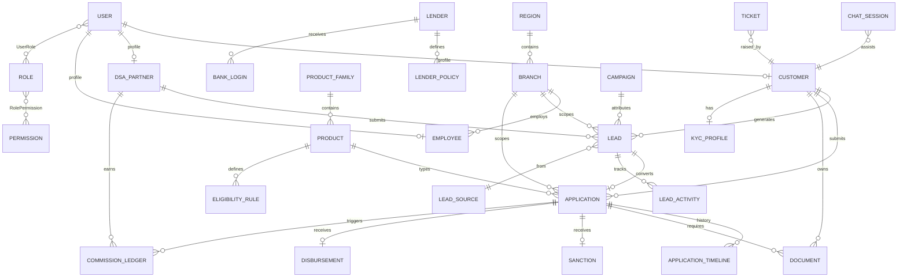

## 26.2 Identity Domain ER Diagram

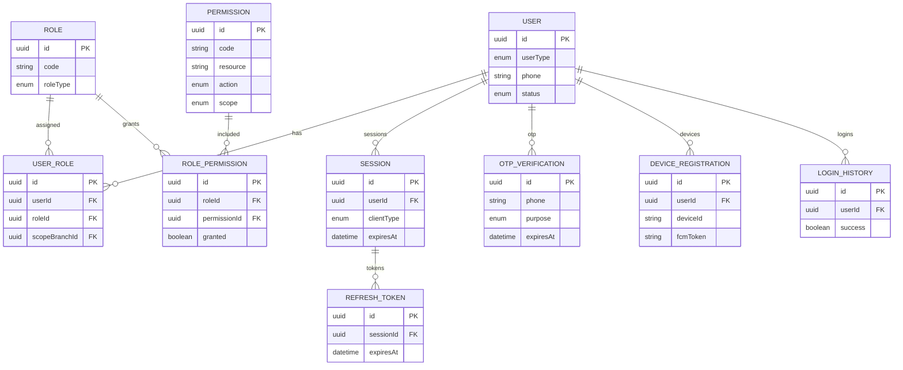

## 26.3 Customer Domain ER Diagram

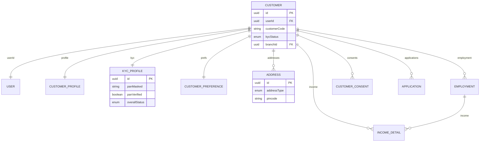

## 26.4 Lead Domain (LMS) ER Diagram

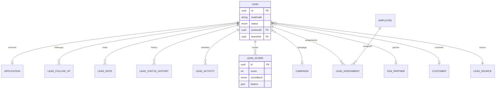

## 26.5 LOS Domain ER Diagram

```mermaid
erDiagram
    APPLICATION }o--|| CUSTOMER : customer
    APPLICATION }o--|| PRODUCT : product
    APPLICATION }o--o| LEAD : lead
    APPLICATION }o--o| DSA_PARTNER : partner
    APPLICATION ||--|| APPLICATION_STATUS : status
    APPLICATION ||--o{ APPLICATION_TIMELINE : timeline
    APPLICATION ||--o{ ELIGIBILITY_RESULT : eligibility
    APPLICATION ||--o{ BANK_LOGIN : bank_logins
    APPLICATION ||--o{ CREDIT_REVIEW : reviews
    APPLICATION ||--o| SANCTION : sanction
    APPLICATION ||--o| DISBURSEMENT : disbursement
    APPLICATION ||--o| CLOSURE : closure
    APPLICATION ||--o| HOME_LOAN_DETAIL : hl_ext
    APPLICATION ||--o| LAP_DETAIL : lap_ext
    APPLICATION ||--o| BUSINESS_LOAN_DETAIL : bl_ext
    APPLICATION ||--o| AUTO_LOAN_DETAIL : al_ext

    APPLICATION {
        uuid id PK
        string applicationCode
        enum currentStage
        enum status
        decimal requestedAmount
    }
    SANCTION {
        uuid id PK
        decimal sanctionedAmount
        decimal interestRate
    }
    DISBURSEMENT {
        uuid id PK
        decimal disbursedAmount
        date disbursementDate
    }
```

## 26.6 Document Domain ER Diagram

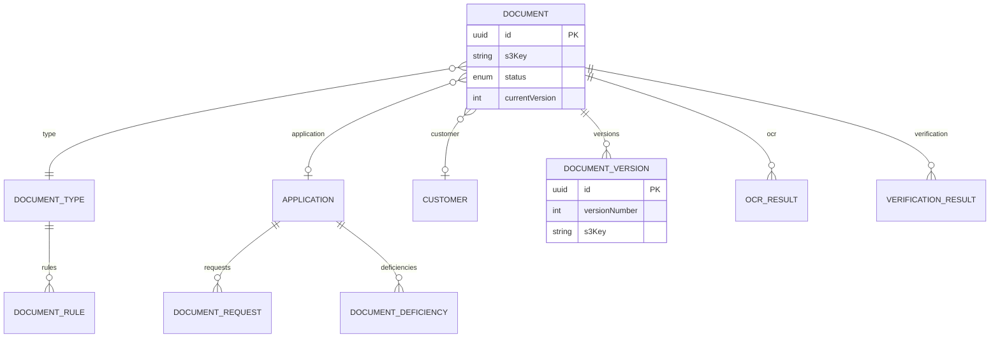

## 26.7 Partner Domain ER Diagram

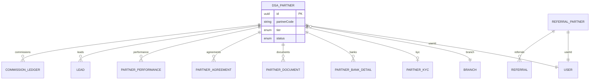

## 26.8 Referral Domain ER Diagram

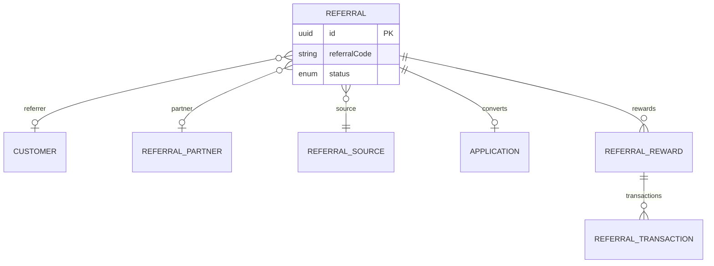

## 26.9 Commission Domain ER Diagram

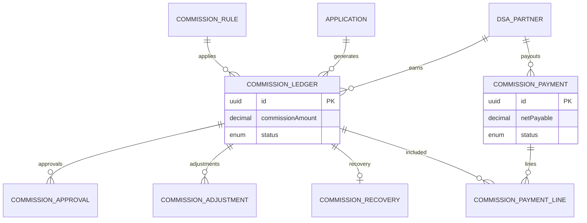

## 26.10 AI Domain ER Diagram

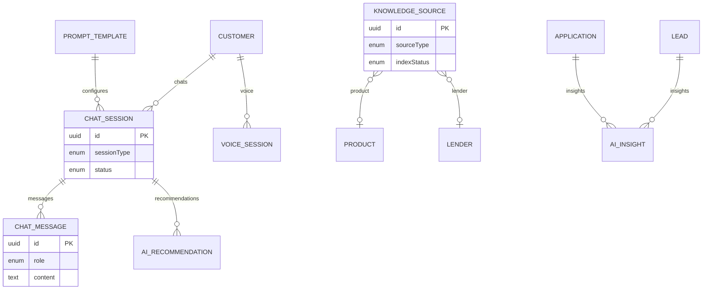

---

# 27. CARDINALITY MATRIX

## 27.1 One-to-One Relationships

| Parent | Child | FK Location | Notes |
|--------|-------|-------------|-------|
| User | Customer | Customer.userId | Unique constraint |
| User | DsaPartner | DsaPartner.userId | — |
| User | Employee | Employee.userId | — |
| User | ReferralPartner | ReferralPartner.userId | — |
| Customer | CustomerProfile | CustomerProfile.customerId | — |
| Customer | KycProfile | KycProfile.customerId | — |
| Customer | CustomerPreference | CustomerPreference.customerId | — |
| Application | ApplicationStatus | ApplicationStatus.applicationId | Current snapshot |
| Application | Sanction | Sanction.applicationId | 0..1 |
| Application | Closure | Closure.applicationId | Terminal |
| Application | HomeLoanDetail | HomeLoanDetail.applicationId | Product extension |
| Application | LapDetail | LapDetail.applicationId | Product extension |
| Application | BusinessLoanDetail | BusinessLoanDetail.applicationId | — |
| Application | AutoLoanDetail | AutoLoanDetail.applicationId | — |
| HomeLoanDetail | HomeLoanBalanceTransferDetail | BT.homeLoanDetailId | BT variants only |
| HomeLoanDetail | HomeLoanTopUpDetail | TopUp.homeLoanDetailId | Top-Up variants |
| LapDetail | LapBalanceTransferDetail | BT.lapDetailId | — |
| LapDetail | LapTopUpDetail | TopUp.lapDetailId | — |
| DsaPartner | PartnerKyc | PartnerKyc.partnerId | — |
| Lead | Application | Application.leadId | Conversion |
| Ticket | Resolution | Resolution.ticketId | — |
| Campaign | CampaignResult | CampaignResult.campaignId | — |

## 27.2 One-to-Many Relationships

| Parent | Child | FK Location | Notes |
|--------|-------|-------------|-------|
| Region | Branch | Branch.regionId | — |
| Branch | Employee | Employee.branchId | — |
| Branch | Lead | Lead.branchId | Tenant scope |
| Branch | Application | Application.branchId | — |
| Branch | DsaPartner | DsaPartner.branchId | — |
| Customer | Address | Address.customerId | Multiple types |
| Customer | Employment | Employment.customerId | History |
| Customer | IncomeDetail | IncomeDetail.customerId | — |
| Customer | CustomerConsent | CustomerConsent.customerId | Versioned |
| Customer | Application | Application.customerId | Multiple products |
| Customer | Lead | Lead.customerId | — |
| Customer | Document | Document.customerId | — |
| Customer | Referral | Referral.referrerCustomerId | — |
| Customer | ChatSession | ChatSession.customerId | — |
| Customer | Ticket | Ticket.customerId | — |
| ProductFamily | Product | Product.familyId | — |
| Product | ProductVariant | ProductVariant.productId | — |
| Product | EligibilityRule | EligibilityRule.productId | — |
| Product | DocumentRule | DocumentRule.productId | — |
| Product | Application | Application.productId | — |
| Lender | LenderPolicy | LenderPolicy.lenderId | — |
| Lender | BankLogin | BankLogin.lenderId | — |
| Lead | LeadScore | LeadScore.leadId | Re-scored |
| Lead | LeadAssignment | LeadAssignment.leadId | History |
| Lead | LeadActivity | LeadActivity.leadId | — |
| Lead | LeadStatusHistory | LeadStatusHistory.leadId | Append-only |
| Lead | LeadNote | LeadNote.leadId | — |
| Lead | LeadFollowUp | LeadFollowUp.leadId | — |
| Application | ApplicationTimeline | ApplicationTimeline.applicationId | — |
| Application | EligibilityResult | EligibilityResult.applicationId | — |
| Application | BankLogin | BankLogin.applicationId | Multi-lender |
| Application | CreditReview | CreditReview.applicationId | — |
| Application | Disbursement | Disbursement.applicationId | Tranches |
| Application | Document | Document.applicationId | — |
| Application | DocumentRequest | DocumentRequest.applicationId | — |
| Application | DocumentDeficiency | DocumentDeficiency.applicationId | — |
| Application | CommissionLedger | CommissionLedger.applicationId | — |
| Document | DocumentVersion | DocumentVersion.documentId | — |
| Document | OcrResult | OcrResult.documentId | — |
| Document | VerificationResult | VerificationResult.documentId | — |
| DsaPartner | Lead | Lead.dsaPartnerId | — |
| DsaPartner | CommissionLedger | CommissionLedger.partnerId | — |
| DsaPartner | PartnerBankDetail | PartnerBankDetail.partnerId | — |
| DsaPartner | PartnerDocument | PartnerDocument.partnerId | — |
| DsaPartner | PartnerAgreement | PartnerAgreement.partnerId | — |
| DsaPartner | PartnerPerformance | PartnerPerformance.partnerId | Snapshots |
| DsaPartner | CommissionPayment | CommissionPayment.partnerId | — |
| Ticket | TicketMessage | TicketMessage.ticketId | — |
| Ticket | TicketAssignment | TicketAssignment.ticketId | — |
| Ticket | Escalation | Escalation.ticketId | — |
| Campaign | CampaignAudience | CampaignAudience.campaignId | — |
| Campaign | CampaignActivity | CampaignActivity.campaignId | — |
| ChatSession | ChatMessage | ChatMessage.sessionId | Ordered |
| User | Session | Session.userId | — |
| User | Notification | Notification.userId | — |
| KpiDefinition | MetricSnapshot | MetricSnapshot.kpiId | — |
| Report | ReportExecution | ReportExecution.reportId | — |

## 27.3 Many-to-Many Relationships

| Entity A | Entity B | Junction Table | Notes |
|----------|----------|----------------|-------|
| User | Role | UserRole | Scope columns on junction |
| Role | Permission | RolePermission | Grant/deny flag |
| CommissionPayment | CommissionLedger | CommissionPaymentLine | Payout line items |
| Dashboard | KpiDefinition | DashboardWidget (in layout JSON) | Logical M:N via JSON |
| Product | Lender | LenderPolicy | Effectively M:N with attributes |

---

# 28. DATA GOVERNANCE

## 28.1 Retention Policies

| Data Category | Active Retention | Archive | Regulatory Basis |
|---------------|-----------------|---------|------------------|
| Customer PII | Life of relationship + 3 years | Anonymize after | RBI KYC norms |
| KYC records | 8 years post-closure | S3 Glacier | RBI Master Direction |
| Loan documents | 8 years post-closure | S3 Glacier at year 3 | RBI lending norms |
| Applications (closed) | 3 years online | Summary + S3 | Business policy |
| Leads (unconverted) | 1 year | Delete | Business policy |
| Commission records | 8 years | Cold storage | Income Tax Act |
| Audit logs | 7 years | Partition drop | Internal compliance |
| Access logs (PII) | 3 years | Archive | DPDP Act readiness |
| AI conversations | 1 year | Anonymize aggregate | Business policy |
| Communication logs | 1 year | Archive | TRAI/DLT compliance |
| Session/OTP records | 90 days | Delete | Security policy |
| Partner KYC | Duration + 3 years | Archive | Business policy |

## 28.2 Archival Policies

| Trigger | Action | Entity |
|---------|--------|--------|
| Application status = CLOSED + 3 years | Move documents to Glacier; retain summary row | Application, Document |
| Lead status = LOST/EXPIRED + 1 year | Soft delete; anonymize PII | Lead |
| Audit log partition > 12 months | Move to cold storage table | AuditLog |
| MetricSnapshot > 5 years | Aggregate to yearly; delete daily | MetricSnapshot |
| ChatSession ended + 1 year | Delete messages; retain anonymized metrics | ChatMessage |

## 28.3 Deletion Policies

| Request Type | Scope | Process |
|--------------|-------|---------|
| Customer deletion request | Customer domain | Verify no active applications; anonymize PII; retain financial records per law |
| Right to erasure (DPDP) | PII fields | Pseudonymize; retain transactional integrity |
| Partner termination | Partner domain | Soft delete; retain commission history |
| Employee resignation | Employee domain | Deactivate User; retain audit trail |
| Hard delete | Never on financial entities | Commission, Disbursement, Audit — append-only |

## 28.4 Compliance Policies

| Regulation | Data Model Control |
|------------|-------------------|
| RBI KYC/AML | KycProfile, KycAudit, PanVerification, AadhaarVerification |
| RBI Fair Practices | ApplicationTimeline, DocumentDeficiency audit trail |
| Income Tax (TDS) | CommissionLedger.tdsAmount, TDS certificates linkage |
| DPDP Act 2023 | CustomerConsent, deletion request tracking, AccessLog |
| TRAI/DLT | Sms.templateCode (DLT registered), consent flags |
| SoD | CommissionApproval separate approver; ApprovalLog |

## 28.5 PII Policies

| PII Field | Storage | API Exposure | Masking |
|-----------|---------|--------------|---------|
| PAN | AES-256 encrypted + panMasked | Role-gated; masked by default | XXXXX1234X |
| Aadhaar | AES-256 encrypted + aadhaarMasked | Compliance/Credit only | XXXX-XXXX-1234 |
| Bank account | AES-256 encrypted + masked | Finance/Partner self only | XXXXXX1234 |
| Phone | Plain (indexed) | Scoped by role | XXX-XXX-1234 for non-assigned |
| Email | Plain | Scoped | j***@domain.com |
| Date of birth | Plain | Credit/Compliance | — |
| Full address | Plain | Assigned roles only | City + pincode only for others |

**Encryption key management:** AWS KMS or application vault; key rotation annually.

---

# 29. FUTURE EXPANSION MODEL

## 29.1 Extension Strategy

New financial products plug into the existing model via:

1. **ProductFamily** — Add row (e.g., `PL`, `INS`, `CC`, `MF`, `FD`, `GL`, `WM`)
2. **Product** — Add product codes (e.g., `PL-01`, `INS-01`)
3. **ProductVariant** — Add variants
4. **Extension table** — Product-specific 1:1 table linked to `Application`
5. **EligibilityRule + DocumentRule** — Product-specific rules
6. **LenderPolicy** — New lender mappings

**No changes required to:** Application, ApplicationTimeline, Document, Commission, Lead, Customer core entities.

## 29.2 Future Product Extension Tables

| Product | Extension Entity | Key Attributes |
|---------|-----------------|----------------|
| Personal Loan | `PersonalLoanDetail` | loanPurpose, existingEmiObligation, unsecuredFlag |
| Insurance | `InsuranceDetail` | policyType (LIFE, HEALTH), sumAssured, premium, nomineeDetails |
| Credit Card | `CreditCardDetail` | cardType, existingCards, requestedLimit, rewardPreference |
| Mutual Fund | `MfApplicationDetail` | riskProfile, fundId, sipAmount, sipDate |
| Fixed Deposit | `FdBookingDetail` | depositAmount, tenureMonths, interestPayout, bankPreference |
| Gold Loan | `GoldLoanDetail` | goldWeightGrams, purity, estimatedValue, pledgeItems (JSON) |
| Wealth Management | `WealthAdvisoryDetail` | portfolioValue, advisoryType, riskTolerance |
| Video KYC | `VideoKycSession` | sessionRecording, agentId, verificationResult (in KYC domain) |
| eSign | `EsignSession` | documentId, signProvider, signedAt (in Document domain) |

## 29.3 Future Domain Additions

| Domain | New Entities | Integration Point |
|--------|-------------|-------------------|
| Insurance | `InsurancePolicy`, `InsuranceClaim` | Customer 360; cross-sell from Application |
| Wealth | `Portfolio`, `Holding`, `SipMandate` | Customer; RM dashboard |
| Lender Portal | `LenderUser`, `LenderSubmission` | Extends BankLogin; separate auth |
| LMS (Learning) | `PartnerCertification`, `CertificationExam` | TrainingMaterial; DsaPartner |
| Loyalty | `LoyaltyPoint`, `LoyaltyTransaction` | Customer; Referral extension |

## 29.4 Polymorphic Application Extension Pattern

```
Application (core)
    ├── HomeLoanDetail         [productFamily = HL]
    ├── LapDetail              [productFamily = LAP]
    ├── BusinessLoanDetail     [productFamily = BL]
    ├── AutoLoanDetail         [productFamily = AL]
    ├── PersonalLoanDetail     [productFamily = PL]  ← Phase 2
    ├── InsuranceDetail        [productFamily = INS] ← Phase 2
    ├── CreditCardDetail       [productFamily = CC]  ← Phase 2
    ├── MfApplicationDetail    [productFamily = MF]  ← Phase 2–3
    ├── FdBookingDetail        [productFamily = FD]  ← Phase 2
    ├── GoldLoanDetail         [productFamily = GL]  ← Phase 3
    └── WealthAdvisoryDetail   [productFamily = WM]  ← Phase 4
```

**Prisma implementation note (for engineering):** Use `productFamilyId` on Application to determine which extension relation to join — no schema redesign needed.

---

# APPENDIX A: COMPLETE ENTITY INDEX

| # | Domain | Entity | Logical Table |
|---|--------|--------|---------------|
| 1 | Identity | User | users |
| 2 | Identity | Role | roles |
| 3 | Identity | Permission | permissions |
| 4 | Identity | RolePermission | role_permissions |
| 5 | Identity | UserRole | user_roles |
| 6 | Identity | Session | sessions |
| 7 | Identity | OtpVerification | otp_verifications |
| 8 | Identity | DeviceRegistration | device_registrations |
| 9 | Identity | LoginHistory | login_history |
| 10 | Identity | RefreshToken | refresh_tokens |
| 11 | Customer | Customer | customers |
| 12 | Customer | CustomerProfile | customer_profiles |
| 13 | Customer | Address | addresses |
| 14 | Customer | Employment | employments |
| 15 | Customer | IncomeDetail | income_details |
| 16 | Customer | KycProfile | kyc_profiles |
| 17 | Customer | CustomerPreference | customer_preferences |
| 18 | Customer | CustomerConsent | customer_consents |
| 19 | Partner | DsaPartner | dsa_partners |
| 20 | Partner | ReferralPartner | referral_partners |
| 21 | Partner | PartnerKyc | partner_kyc |
| 22 | Partner | PartnerBankDetail | partner_bank_details |
| 23 | Partner | PartnerDocument | partner_documents |
| 24 | Partner | PartnerPerformance | partner_performance |
| 25 | Partner | PartnerAgreement | partner_agreements |
| 26 | Organization | Employee | employees |
| 27 | Organization | Branch | branches |
| 28 | Organization | Region | regions |
| 29 | Organization | Department | departments |
| 30 | Organization | ReportingStructure | reporting_structures |
| 31 | Product | ProductFamily | product_families |
| 32 | Product | Product | products |
| 33 | Product | ProductVariant | product_variants |
| 34 | Product | EligibilityRule | eligibility_rules |
| 35 | Product | DocumentRule | document_rules |
| 36 | Product | Lender | lenders |
| 37 | Product | LenderPolicy | lender_policies |
| 38 | LMS | Lead | leads |
| 39 | LMS | LeadSource | lead_sources |
| 40 | LMS | LeadScore | lead_scores |
| 41 | LMS | LeadAssignment | lead_assignments |
| 42 | LMS | LeadActivity | lead_activities |
| 43 | LMS | LeadStatusHistory | lead_status_history |
| 44 | LMS | LeadNote | lead_notes |
| 45 | LMS | LeadFollowUp | lead_follow_ups |
| 46 | LOS | Application | applications |
| 47 | LOS | ApplicationStatus | application_statuses |
| 48 | LOS | ApplicationTimeline | application_timelines |
| 49 | LOS | EligibilityResult | eligibility_results |
| 50 | LOS | BankLogin | bank_logins |
| 51 | LOS | CreditReview | credit_reviews |
| 52 | LOS | Sanction | sanctions |
| 53 | LOS | Disbursement | disbursements |
| 54 | LOS | Closure | closures |
| 55 | HL | HomeLoanDetail | home_loan_details |
| 56 | HL | HomeLoanBalanceTransferDetail | home_loan_bt_details |
| 57 | HL | HomeLoanTopUpDetail | home_loan_topup_details |
| 58 | LAP | LapDetail | lap_details |
| 59 | LAP | LapBalanceTransferDetail | lap_bt_details |
| 60 | LAP | LapTopUpDetail | lap_topup_details |
| 61 | BL | BusinessLoanDetail | business_loan_details |
| 62 | BL | WorkingCapitalDetail | working_capital_details |
| 63 | BL | OdCcDetail | od_cc_details |
| 64 | AL | AutoLoanDetail | auto_loan_details |
| 65 | AL | AutoLoanBtDetail | auto_loan_bt_details |
| 66 | AL | AutoLoanTopUpDetail | auto_loan_topup_details |
| 67 | Document | Document | documents |
| 68 | Document | DocumentType | document_types |
| 69 | Document | DocumentRequest | document_requests |
| 70 | Document | OcrResult | ocr_results |
| 71 | Document | VerificationResult | verification_results |
| 72 | Document | DocumentDeficiency | document_deficiencies |
| 73 | Document | DocumentVersion | document_versions |
| 74 | KYC | PanVerification | pan_verifications |
| 75 | KYC | AadhaarVerification | aadhaar_verifications |
| 76 | KYC | KycStatus | kyc_statuses |
| 77 | KYC | KycAudit | kyc_audits |
| 78 | Referral | Referral | referrals |
| 79 | Referral | ReferralSource | referral_sources |
| 80 | Referral | ReferralReward | referral_rewards |
| 81 | Referral | ReferralTransaction | referral_transactions |
| 82 | Commission | CommissionRule | commission_rules |
| 83 | Commission | CommissionLedger | commission_ledger |
| 84 | Commission | CommissionApproval | commission_approvals |
| 85 | Commission | CommissionPayment | commission_payments |
| 86 | Commission | CommissionAdjustment | commission_adjustments |
| 87 | Commission | CommissionRecovery | commission_recoveries |
| 88 | Commission | CommissionPaymentLine | commission_payment_lines |
| 89 | Support | Ticket | tickets |
| 90 | Support | TicketMessage | ticket_messages |
| 91 | Support | TicketAssignment | ticket_assignments |
| 92 | Support | Escalation | escalations |
| 93 | Support | Resolution | resolutions |
| 94 | Communication | Notification | notifications |
| 95 | Communication | Email | emails |
| 96 | Communication | Sms | sms_messages |
| 97 | Communication | WhatsApp | whatsapp_messages |
| 98 | Communication | PushNotification | push_notifications |
| 99 | Communication | CommunicationLog | communication_logs |
| 100 | Campaign | Campaign | campaigns |
| 101 | Campaign | CampaignAudience | campaign_audiences |
| 102 | Campaign | CampaignActivity | campaign_activities |
| 103 | Campaign | CampaignResult | campaign_results |
| 104 | AI | ChatSession | chat_sessions |
| 105 | AI | ChatMessage | chat_messages |
| 106 | AI | AiRecommendation | ai_recommendations |
| 107 | AI | AiInsight | ai_insights |
| 108 | AI | VoiceSession | voice_sessions |
| 109 | AI | KnowledgeSource | knowledge_sources |
| 110 | AI | PromptTemplate | prompt_templates |
| 111 | KB | KnowledgeArticle | knowledge_articles |
| 112 | KB | Faq | faqs |
| 113 | KB | SalesScript | sales_scripts |
| 114 | KB | KnowledgeCategory | knowledge_categories |
| 115 | KB | KnowledgeArticleVersion | knowledge_article_versions |
| 116 | KB | TrainingMaterial | training_materials |
| 117 | Analytics | KpiDefinition | kpi_definitions |
| 118 | Analytics | MetricSnapshot | metric_snapshots |
| 119 | Analytics | Dashboard | dashboards |
| 120 | Analytics | Report | reports |
| 121 | Analytics | ReportExecution | report_executions |
| 122 | Audit | AuditLog | audit_logs |
| 123 | Audit | AccessLog | access_logs |
| 124 | Audit | ChangeLog | change_logs |
| 125 | Audit | ApprovalLog | approval_logs |
| 126 | Audit | SecurityEvent | security_events |
| 127 | Settings | SystemSetting | system_settings |
| 128 | Settings | ProductSetting | product_settings |
| 129 | Settings | NotificationSetting | notification_settings |
| 130 | Settings | SecuritySetting | security_settings |
| 131 | Settings | AiSetting | ai_settings |

**Total: 131 logical entities** (112 core + 19 product extension/junction entities)

---

# APPENDIX B: PRISMA SCHEMA PLANNING GUIDE

| Prisma Pattern | Application |
|----------------|-------------|
| `@@map("table_name")` | snake_case table mapping |
| `@id @default(uuid())` | UUID primary keys |
| `@updatedAt` | Auto-update timestamp |
| `enum` types | All status/lifecycle fields |
| `@@index([branchId, status])` | Queue queries |
| `@@unique([userId])` | 1:1 profile constraints |
| `@relation` | Explicit FK naming |
| `Json` type | metadata, ruleDefinition, layout |
| `@@softDelete` (middleware) | deletedAt pattern |
| Domain folders in schema | `// Identity`, `// Customer`, etc. |

---

# APPENDIX C: INDEX STRATEGY SUMMARY

| Table Group | Critical Indexes |
|-------------|-----------------|
| leads | (branchId, status, createdAt), (assignedToId, status), (dsaPartnerId, createdAt) |
| applications | (customerId), (branchId, currentStage), (assignedSalesId, status) |
| commission_ledger | (partnerId, status), (applicationId) |
| documents | (applicationId, documentTypeId), (customerId) |
| audit_logs | (entityType, entityId), (actorId, createdAt), (createdAt) RANGE partition |
| users | (phone) UNIQUE, (email) |
| chat_sessions | (customerId, startedAt) |

---

# APPENDIX D: ENUM REGISTRY (Key Enums)

| Enum | Values |
|------|--------|
| UserType | CUSTOMER, DSA, REFERRAL, EMPLOYEE |
| ApplicationStage | S01_LEAD_CREATED, S02_QUALIFIED, S03_DOC_COLLECTION, S04_ELIGIBILITY, S05_BANK_LOGIN, S06_CREDIT_REVIEW, S07_SANCTION, S08_DISBURSEMENT, S09_CLOSURE |
| ApplicationStatus | DRAFT, IN_PROGRESS, ON_HOLD, APPROVED, REJECTED, WITHDRAWN, DISBURSED, CLOSED |
| LeadStatus | NEW, CONTACTED, QUALIFIED, UNQUALIFIED, CONVERTED, LOST, EXPIRED |
| DocumentStatus | UPLOADED, PENDING_VERIFICATION, VERIFIED, REJECTED, DEFICIENT |
| CommissionStatus | PENDING, APPROVED, PAID, DISPUTED, CLAWED_BACK |
| KycOverallStatus | NOT_STARTED, IN_PROGRESS, COMPLETE, REJECTED, EXPIRED |
| PartnerTier | BRONZE, SILVER, GOLD, PLATINUM |
| TicketStatus | OPEN, IN_PROGRESS, PENDING_CUSTOMER, RESOLVED, CLOSED, ESCALATED |

---

# APPENDIX E: DOCUMENT APPROVAL

| Role | Name | Signature | Date |
|------|------|-----------|------|
| Chief Data Architect | | | |
| CTO | | | |
| Head of Engineering | | | |
| Compliance Officer | | | |
| CEO / Managing Director | | | |

---

# APPENDIX F: REVISION HISTORY

| Version | Date | Author | Changes |
|---------|------|--------|---------|
| 1.0 | June 2026 | Kuber Finserve Data Architecture Team | Initial ER Diagram & Enterprise Data Model |

---

# APPENDIX G: RELATED DOCUMENT INDEX

| Document | Relationship |
|----------|-------------|
| [KUBERONE_SYSTEM_ARCHITECTURE.md](./KUBERONE_SYSTEM_ARCHITECTURE.md) | Database architecture, Prisma usage, indexing |
| [KUBERONE_RBAC_AND_PERMISSIONS.md](./KUBERONE_RBAC_AND_PERMISSIONS.md) | Role/permission entities, resource registry |
| [KUBERONE_LOAN_PRODUCTS_AND_SERVICES.md](./KUBERONE_LOAN_PRODUCTS_AND_SERVICES.md) | Product catalog, LOS stages, document rules |
| [KUBERONE_SCREEN_PLANNING_AND_IA.md](./KUBERONE_SCREEN_PLANNING_AND_IA.md) | Screen-to-entity mapping for UI |
| [KUBERONE_USER_TYPES_AND_ROLES.md](./KUBERONE_USER_TYPES_AND_ROLES.md) | Persona workflows driving entity relationships |

---

**© 2026 Kuber Finserve. Confidential — For Internal, Database, Backend, and Architecture Use.**

*This document is the authoritative enterprise data model for KuberOne. Prisma schema, MySQL DDL, and API contracts must align with entities and relationships defined herein.*
